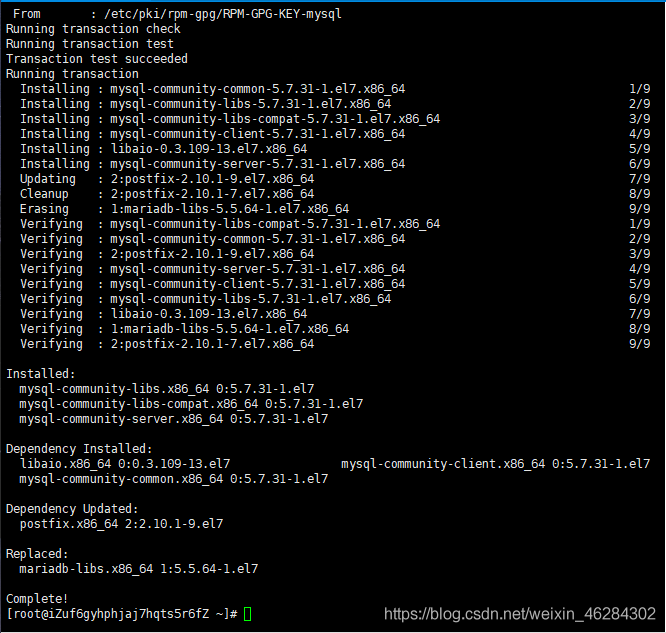

# 阿里云 ECS——搭建 Java Web 开发环境

## 1. 安装 JDK

1. 1 执行以下命令，查看 yum 源中 JDK 版本。

```
yum list java*
```

1. 2 执行以下命令，使用 yum 安装 JDK1.8。

```
yum -y install java-1.8.0-openjdk*
```

1. 3 执行以下命令，查看是否安装成功。

```
java -version
```

如果显示如下图内容，则表示 JDK 安装成功。


## 2. 安装 MySQL 数据库

2. 1 执行以下命令，下载并安装 MySQL 官方的`Yum Repository`。

```
wget http://dev.mysql.com/get/mysql57-community-release-el7-10.noarch.rpm
yum -y install mysql57-community-release-el7-10.noarch.rpm
yum -y install mysql-community-server
```



2. 2 执行以下命令，启动 MySQL 数据库。

```
systemctl start mysqld.service
```

2. 3 执行以下命令，查看 MySQL 初始密码。

```
grep "password" /var/log/mysqld.log
```


2. 4 执行以下命令，登录数据库。

```
mysql -uroot -p
```

2. 5 执行以下命令，修改 MySQL 默认密码。

```
set global validate_password_policy=0;  #修改密码安全策略为低（只校验密码长度，至少 8 位）。
ALTER USER 'root'@'localhost' IDENTIFIED BY '12345678';
```

2. 6 执行以下命令，授予 root 用户远程管理权限。

```
GRANT ALL PRIVILEGES ON *.* TO 'root'@'%' IDENTIFIED BY '12345678';
```

2. 7 输入`exit`退出数据库。

## 3. 安装 Tomcat

3. 1 执行以下命令，下载 Tomcat 压缩包。

```
wget https://mirror.bit.edu.cn/apache/tomcat/tomcat-8/v8.5.57/bin/apache-tomcat-8.5.57.tar.gz
```


3.  2 执行以下命令，解压刚刚下载 Tomcat 包。

```
tar -zxvf apache-tomcat-8.5.57.tar.gz
```

3.  3 执行以下命令，修改 Tomcat 名字。

```
mv apache-tomcat-8.5.57 /usr/local/Tomcat8.5
```

3. 4 执行以下命令，为 Tomcat 授权。

```
chmod +x /usr/local/Tomcat8.5/bin/*.sh
```

3. 5 执行以下命令，修改 Tomcat 默认端口号为`80`。

说明：Tomcat 默认端口号为 8080。

```
sed -i 's/Connector port="8080"/Connector port="80"/' /usr/local/Tomcat8.5/conf/server.xml
```

3. 6 启动 Tomcat。

```
/usr/local/Tomcat8.5/bin/./startup.sh
```


## 4. 访问 Tomcat

4.  1 打开浏览器，在地址栏中输入 ECS 公网地址，例如：`139.0.0.1`

​ 如果显示如下界面，则表示 Tomcat 安装配置成功。

 4. 2 至此，Java Web 开发环境搭建完成。

<!-- <Valine></Valine> -->
