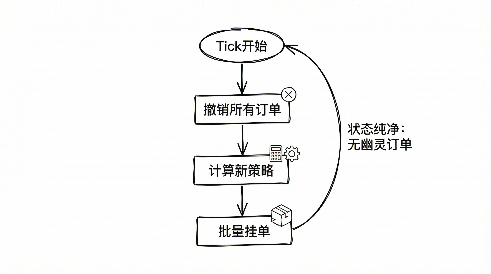

# Polymarket 量化交易实战（四）：批量下单与优化

**从 1 秒 1 单，到 1 秒 10 单。**

在 V3 版本中，我犯了一个新手错误：串行下单。

```python
# 错误示范
await self.place_order(yes_token) # 请求 1
await self.place_order(no_token)  # 请求 2
```

这种写法有两个致命问题：
1.  **慢**：两次握手，两次 RTT，延迟翻倍。
2.  **险**：如果第一单成了，第二单网络超时怎么办？你的仓位瞬间**裸露（Naked Position）**，无法形成对冲。

**在做市策略中，降低延迟和网络不确定性比单纯追求速度更重要。**

#### 1. 批量下单的威力


Polymarket 的 L2 接口支持 Batch API（最多 15 个订单）。我们可以把一篮子订单打包，一次性发出去。

**性能对比：**

*   **单次下单**：签名(5ms) + 网络(150ms) = **155ms / 单**
*   **批量下单(10单)**：签名(50ms) + 网络(150ms) = **200ms / 10单**

效率提升了接近 **8 倍**。

**注意：批量下单不是原子性操作。** 每个订单独立处理，可能部分成功部分失败。但它大幅降低了"网络竞态"的风险——订单在同一时刻到达服务器，比串行发送更可控。

#### 2. 激进的策略：全撤全挂



高频交易中，**修改订单（Modify）**是最复杂的操作。

你需要处理：部分成交、挂单中、已取消、网络竞态... 状态机的复杂度呈指数级上升。

为了睡个安稳觉，我采用了 **"Cancel-All-Then-Place"** 模式：

```python
async def tick(self):
    # 1. 毫不留情：先撤掉上一轮的所有订单
    await self.cancel_all_orders()

    # 2. 重新计算：基于最新 Orderbook 计算新价格
    new_orders = calculate_strategy()

    # 3. 批量挂单：将新的一组订单打包发出
    await self.place_orders_batch(new_orders)
```

**为什么这么做？**

虽然这会消耗更多 API Quota，但它保证了**状态的绝对纯净**。每次 Tick 都是一次全新的开始，永远不会有“幽灵订单”困扰你。

#### 3. 榨干网络性能：Keep-Alive

在 Python 的 `requests` 库中，如果你直接调用 `post`，每次都会新建 TCP 连接。

对于位于 AWS/GCP 的服务器，建立 SSL 握手的开销（30-50ms）是巨大的。

**解决方案：连接池复用。**

```python
session = requests.Session()
adapter = requests.adapters.HTTPAdapter(
    pool_connections=20,
    pool_maxsize=20
)
session.mount("https://", adapter)
```

这几行代码，能让你的延迟稳定下降 30%。

#### 总结

通过 `place_orders_batch` 和全局 Session 优化，我们将机器人的“手速”提升到了极限。

*   **低延迟**：减少网络往返，多腿订单在同一时刻到达服务器。
*   **高吞吐**：在 API 限流范围内做更多操作。
*   **健壮性**：全撤全挂模式降低了状态维护复杂度，避免幽灵订单。
*   **容错**：即使部分订单失败，也能通过返回值快速识别并处理。

至此，技术篇的核心模块（鉴权、数据流、资金流、交易流）已全部构建完成。

接下来的文章，我们将跳出代码，复盘这段时间的开发历程。看看一个“玩具脚本”是如何在真实市场的毒打中，一步步进化成现在这个样子的。
