# 💡 Let There Be Light: The Linux GPIO Starter Guide

In the world of embedded development, "Blinking an LED" is the equivalent of "Hello World" in software. If you can control an LED, you can control a relay, a motor, or even a nuclear launch silo (theoretically... please don't).

In Linux, there is a golden rule: **"Everything is a file"**.

Yes, even hardware pins are files. We can control voltage levels just by reading and writing text files. How cool is that?

## 🗺️ The Core Workflow: The Way of SYSFS

We use the `sysfs` interface to manipulate GPIOs. Imagine you're a system administrator giving orders to the hardware by modifying a "config sheet" in the file system.

```mermaid
graph LR
    A[User Space] -->|Write File| B(sysfs File System)
    B -->|Driver Call| C[Kernel Space]
    C -->|Control Register| D((Hardware GPIO Pin))
    D -->|Current Flow| E[💡 LED]
```



## 🛠️ Hands-on: Light Up Your World in 5 Steps

Let's assume we want to control pin `GPIO53` (Check your development board's manual for the actual mapping).

### 1. Claim Your Territory (Export)

First, we tell the kernel: "This pin is mine now." This generates a new folder `gpio53` under `/sys/class/gpio/`.

```bash
# "Hey Kernel, get pin 53 ready for me"
echo 53 | sudo tee /sys/class/gpio/export
```

### 2. Set the Rules (Direction)

Is the pin for **listening** (Input, like a button) or **shouting** (Output, like an LED)? We're controlling an LED, so it's an Output.

```bash
# "I'm using this pin to send signals out"
echo "out" | sudo tee /sys/class/gpio/gpio53/direction
```

### 3. Let There Be Light (Value High)

The moment of truth. Writing `1` means High Voltage (usually 3.3V or 1.8V). The LED turns on!

```bash
# "Power ON!"
echo 1 | sudo tee /sys/class/gpio/gpio53/value
```

### 4. Darkness Falls (Value Low)

Writing `0` means Low Voltage (GND). The LED turns off.

```bash
# "Power OFF!"
echo 0 | sudo tee /sys/class/gpio/gpio53/value
```

### 5. Return What You Borrowed (Unexport)

Always release resources when you're done. It's good manners.

```bash
# "I'm done, you can have it back"
echo 53 | sudo tee /sys/class/gpio/unexport
```

## 📜 The Lazy Script (Cheat Sheet)

Save the following script as `blink.sh`, change `PIN_NUM`, and run it anywhere.

```bash
#!/bin/bash
PIN_NUM=53

echo "Testing GPIO $PIN_NUM..."

# 1. Export
echo $PIN_NUM | sudo tee /sys/class/gpio/export > /dev/null

# 2. Set Output
echo "out" | sudo tee /sys/class/gpio/gpio$PIN_NUM/direction

# 3. Blink 3 times
for i in {1..3}
do
    echo "ON"
    echo 1 | sudo tee /sys/class/gpio/gpio$PIN_NUM/value
    sleep 0.5
    echo "OFF"
    echo 0 | sudo tee /sys/class/gpio/gpio$PIN_NUM/value
    sleep 0.5
done

# 4. Cleanup
echo $PIN_NUM | sudo tee /sys/class/gpio/unexport > /dev/null
echo "Done!"
```

## 🤔 Food for Thought

Using `sysfs` (echo/cat) is simple and intuitive, great for shell scripts and debugging. But for high-performance scenarios (like simulating PWM waveforms or rapid IO flipping), this method is painfully slow (because every operation involves file system IO and User/Kernel space context switching).

For serious C/C++ programs, I recommend using `libgpiod` or directly manipulating registers (mmap). But for just blinking a light to celebrate a Friday deploy? `echo 1` is perfect!
