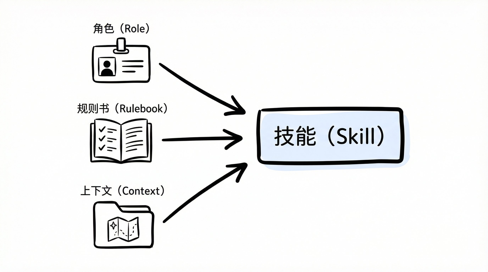

# 提示词工程已死？Agent Skills 才是未来

2023 年，"Prompt Engineering"（提示词工程）一度被奉为 AI 时代的必修课。那时候，我们像炼丹师一样，试图通过修改一个标点、调整一段语序，来祈求模型输出完美的结果。

但到了 2026 年的今天，这种做法显得越来越笨重，甚至有些**不可持续**。

仔细观察会发现，我们陷入了一个误区：我们花费大量精力去“适应”机器，试图用自然语言去模拟机器的逻辑。一旦模型更新，或者上下文环境改变，那些精心调教的 Prompt 往往会瞬间失效。

这不叫工程，这叫**碰运气**。

真正的未来，或许不在于写出更完美的 Prompt，而在于构建更稳健的 **Skills (技能)**。

## Prompt 的本质缺陷

为什么 Prompt Engineering 难以规模化？因为它本质上是一种**硬编码 (Hard-coding)**。

在软件工程中，硬编码通常意味着脆弱和难以维护。Prompt 也是如此：

1.  **缺乏复用性**：针对 GPT-4 优化的指令，扔给 Claude 可能完全跑偏。
2.  **上下文割裂**：每次对话都需要重复输入背景信息，效率极低。
3.  **状态缺失**：Prompt 是一次性的，它无法像对象一样保存状态或记忆偏好。

当我们需要构建复杂的 AI 应用时，单纯的 Prompt 已经无法满足需求。我们需要从“脚本思维”进化到“对象思维”。

## 什么是 Skill？

在 Agentic Coding（代理编码）的语境下，Skill 不再是一段简单的文本，它更像是一个封装良好的**对象 (Object)**。

$$ Skill = Role (角色卡) + Rulebook (规则书) + Context (上下文) $$



*   **Role (角色)**：定义了它“是谁”。这类似于面向对象中的 `Class` 定义。
*   **Rulebook (规则书)**：定义了它“能做什么”，以及更重要的“**不能做什么**”。这是它的接口 (`Interface`) 和约束。
*   **Context (上下文)**：自动读取必要的环境信息（如项目结构、代码风格）。这是它的成员变量 (`Properties`)。

这种封装带来的好处是显而易见的：我们把一头不可控的野兽（Raw LLM），训练成了一只可靠的导盲犬（Agent）。

## 实战：打造一个“私人技术作家”

为了更直观地理解 Skill 的价值，我们可以看一个真实的案例。

写技术博客时，我们常常面临一个困境：AI 生成的内容往往带有一种浓重的“AI 味”——四平八稳，充满了“总而言之”、“综上所述”这样的废话，缺乏独特的观点和风格。

如果用 Prompt Engineering 的思路，我们需要每次都输入一段几百字的指令来纠正它的语气。但这非常繁琐。

如果用 Skill 的思路，我们可以将这些要求固化下来，创建一个名为 `personal-tech-writer` 的技能。

### 1. 结构化定义

在这个 Skill 中，我们不再是“对话”，而是在“配置”：

```yaml
---
name: personal-tech-writer
description: Baoyu's writing persona (Pragmatic, Story-driven, Vulnerable).
---

# Rulebook (规则书)

## 1. The Hook (切入点)
*   **Don't** start with definitions. Start with a phenomenon or a question.
*   **Focus**: Clarity and Narrative Flow.

## 2. Tone (基调)
*   **Objective**: Avoid "I think" overuse. Focus on the insight itself.
*   **Lucid**: Explain complex concepts with simple analogies.

## 3. Formatting (格式)
*   **No Emojis**: Keep it clean.
*   **Rhythm**: Use breathable paragraphs.
```

### 2. 隐式上下文注入

Skill 的核心优势在于**上下文注入**。

当调用 `/skill personal-tech-writer` 时，系统会自动加载预设的风格指南 (`style-guide.md`)。这就像是给浏览器安装了一个插件，或者给电脑安装了一个驱动程序。

AI 瞬间就“懂”了你的偏好。它不再试图讨好你，而是按照预设的规则，以一种清晰、流畅、有节奏感的方式进行输出。

这就是 **Agent** 的力量。

## 从脚本到面向对象

如果将这种转变放在计算机发展史的维度来看，它像极了从 **汇编语言** 到 **高级语言** 的进化，或者从 **过程式脚本** 到 **面向对象编程** 的范式转移。


*   **Prompt** 是脆弱的脚本。它是线性的，依赖运气的。
*   **Skill** 是稳固的对象。它是封装的，可复用的，有确定性的。

我们正在经历一场从“自然语言交互”到“结构化指令交互”的认知升级。

你不再是在和一个聊天机器人闲聊，你是在**调用 API**。只不过这个 API 的内核是 LLM，参数是自然语言，返回值是高质量的交付物。

## 结语

不要再沉迷于收集那些所谓的“神级 Prompt”了。

那是在捡芝麻。

去构建属于你自己的 **Skill Library**。把你的工作流、你的审美、你的红线，固化成一个个可调用的模块。这才是 AI 时代属于你个人的**核心资产**。

工具会变，模型会变，但你**定义问题**和**封装世界**的能力，才是不可替代的。

---

*END*
