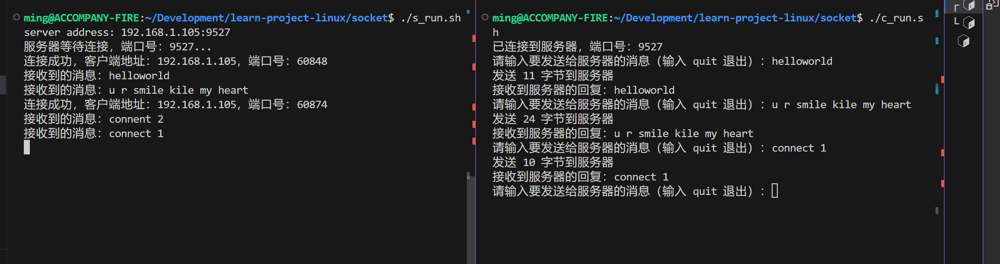
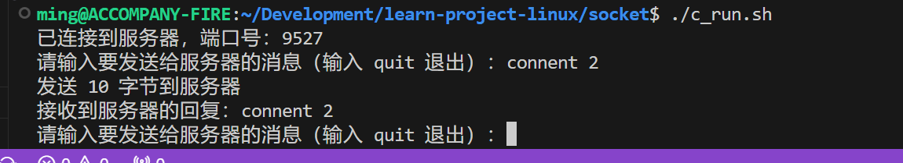

# Linux 下的 Socket 和进程使用

在 Linux 环境中，通过搭建服务器端和客户端服务来实现 Socket 通信，并利用多进程来有效地管理客户端。

# Socket 通讯流程

下面是 socket 服务端和客户端通讯流程：


使用 Socket 我们需要了解几个常用的函数：

## 服务端：

### socket

> NAME
> socket - create an endpoint for communication
>
> SYNOPSIS
> #include <sys/types.h> /_ See NOTES _/
> #include <sys/socket.h>
>
>        int socket(int domain, int type, int protocol);

socket 函数用来创建一个通信端点， domain 为指定通信域， 常用通信协议族有 AF_INET（ IPv4），AF_INET6（IPv6）；type 为 socket，常用的有 SOCK_STREAM（TCP），SOCK_DGRAM(UDP)；protocol 指定通信协议，可以使用默认 0。

### bind

> NAME
> bind - bind a name to a socket
>
> SYNOPSIS
> #include <sys/types.h> /_ See NOTES _/
> #include <sys/socket.h>
>
>        int bind(int sockfd, const struct sockaddr *addr,
>                 socklen_t addrlen);

使用 bind 绑定 socket 文件描述符。

### listen

> NAME
> listen - listen for connections on a socket
>
> SYNOPSIS
> #include <sys/types.h> /_ See NOTES _/
> #include <sys/socket.h>
>
>        int listen(int sockfd, int backlog);

使用 listen 监听 socket 连接。

### accept

> NAME
> accept, accept4 - accept a connection on a socket
>
> SYNOPSIS
> #include <sys/types.h> /_ See NOTES _/
> #include <sys/socket.h>
>
>        int accept(int sockfd, struct sockaddr *addr, socklen_t *addrlen);

使用 accept 接受 socket 连接。

### recv

> NAME
> recv, recvfrom, recvmsg - receive a message from a socket
>
> SYNOPSIS
> #include <sys/types.h>
> #include <sys/socket.h>

使用 recv 函数接收 socket 消息。

### send

> NAME
> send, sendto, sendmsg - send a message on a socket
>
> SYNOPSIS
> #include <sys/types.h>
> #include <sys/socket.h>

使用 send 函数发送 socket 消息。

### connect

> NAME
> connect - initiate a connection on a socket
>
> SYNOPSIS
> #include <sys/types.h> /_ See NOTES _/
> #include <sys/socket.h>
>
>        int connect(int sockfd, const struct sockaddr *addr,
>                    socklen_t addrlen);

客户端可以使用 connect 连接到 socket 服务端。

### close

> NAME
> close - close a file descriptor
>
> SYNOPSIS
> #include <unistd.h>
>
>        int close(int fd);

关闭 socket。

## Socket 代码实现

### server.c

```c
#include <stdio.h>
#include <sys/types.h>
#include <sys/socket.h>
#include <arpa/inet.h>
#include <string.h>
#include <stdlib.h>
#include <unistd.h>

#define MAX_PADDING 10
#define MAX_LINE 256

int main(int argc, char *argv[])
{
    if (argc != 3)
    {
        fprintf(stderr, "Usage: %s <server_address> <port>\n", argv[0]);
        exit(EXIT_FAILURE);
    }

    int s_fd, c_fd;

    char buf[MAX_LINE];

    struct sockaddr_in server_addr, client_addr;

    int len, bytes_received;

    s_fd = socket(AF_INET, SOCK_STREAM, 0);

    if (s_fd == -1)
    {
        perror("Socket error");
        exit(1);
    }

    memset(&server_addr, 0, sizeof(server_addr));
    server_addr.sin_family = AF_INET;
    server_addr.sin_addr.s_addr = inet_addr(argv[1]);
    server_addr.sin_port = htons(atoi(argv[2]));

    printf("server address: %s:%s\n", argv[1], argv[2]);

    int status = bind(s_fd, (struct sockaddr *)&server_addr, sizeof(server_addr));
    if (status == -1)
    {
        perror("Bind  error");
        close(s_fd);
        exit(1);
    }

    if (listen(s_fd, MAX_PADDING) == -1)
    {
        perror("Listeb error");
        close(s_fd);
        exit(1);
    }

    printf("服务器等待连接，端口号：%s...\n", argv[2]);

    // 接收来自客户端的数据
    while (1)
    {
        len = sizeof(client_addr);

        c_fd = accept(s_fd, (struct sockaddr *)&client_addr, &len);

        if (c_fd == -1)
        {
            perror("Accept error");
            close(s_fd);
            exit(1);
        }

        printf("连接成功，客户端地址：%s，端口号：%d\n", inet_ntoa(client_addr.sin_addr), ntohs(client_addr.sin_port));

        while (1)
        {
            // 接受来自客户端的数据
            bytes_received = recv(c_fd, buf, MAX_LINE, 0);
            if (bytes_received > 0)
            {
                buf[bytes_received] = '\0';
                printf("接收到的消息：%s", buf);

                // 回显数据给客户端
                if (send(c_fd, buf, bytes_received, 0) == -1)
                {
                    perror("Send error");
                    close(c_fd);
                    close(s_fd);
                    exit(1);
                }
            }
            else if (bytes_received == -1)
            {
                perror("Receive error");
                exit(EXIT_FAILURE);
            }
        }
    }

    close(s_fd);

    return 0;
}
```

### client.c

```c
#include <stdio.h>
#include <sys/types.h>
#include <sys/socket.h>
#include <arpa/inet.h>
#include <string.h>
#include <stdlib.h>
#include <unistd.h>

#define MAX_LINE 256

int main(int argc, char *argv[])
{
    if (argc != 3)
    {
        fprintf(stderr, "Usage: %s <server_address> <port>\n", argv[0]);
        exit(EXIT_FAILURE);
    }

    int c_fd;
    char buf[MAX_LINE];
    struct sockaddr_in client_addr;
    int len, bytes_sent;

    if ((c_fd = socket(AF_INET, SOCK_STREAM, 0)) == -1)
    {
        perror("Socket error");
        exit(1);
    }

    // 初始化服务器地址结构
    memset(&client_addr, 0, sizeof(client_addr));
    client_addr.sin_family = AF_INET;
    client_addr.sin_addr.s_addr = inet_addr(argv[1]);
    client_addr.sin_port = htons(atoi(argv[2]));

    int status = connect(c_fd, (struct sockaddr *)&client_addr, sizeof(client_addr));
    if (status == -1)
    {
        perror("Connect error");
        close(c_fd);
        exit(1);
    }

    printf("已连接到服务器，端口号：%s\n", argv[2]);

    while (1)
    {
        // 发送数据到服务器
        printf("请输入要发送给服务器的消息（输入 quit 退出）：");
        fgets(buf, MAX_LINE, stdin);

        if (strcmp(buf, "quit\n") == 0)
            break;

        bytes_sent = send(c_fd, buf, sizeof(buf), 0);
        if (bytes_sent == -1)
        {
            perror("Send error");
            close(c_fd);
            exit(1);
        }
        printf("发送 %d 字节到服务器\n", bytes_sent);

        // 接收来自服务器的回复
        len = recv(c_fd, buf, MAX_LINE, 0);
        if (len == -1)
        {
            perror("Receive error");
            close(c_fd);
            exit(EXIT_FAILURE);
        }

        buf[len] = '\0';
        printf("接收到服务器的回复：%s", buf);
    }

    // 关闭套接字
    close(c_fd);

    return 0;
}
```




