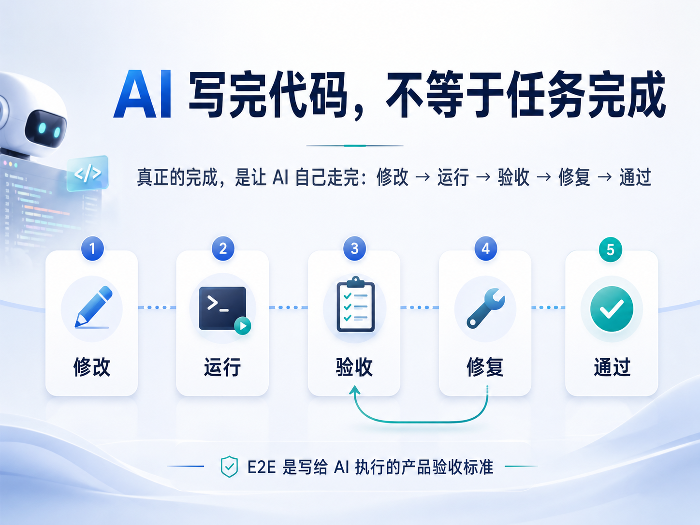
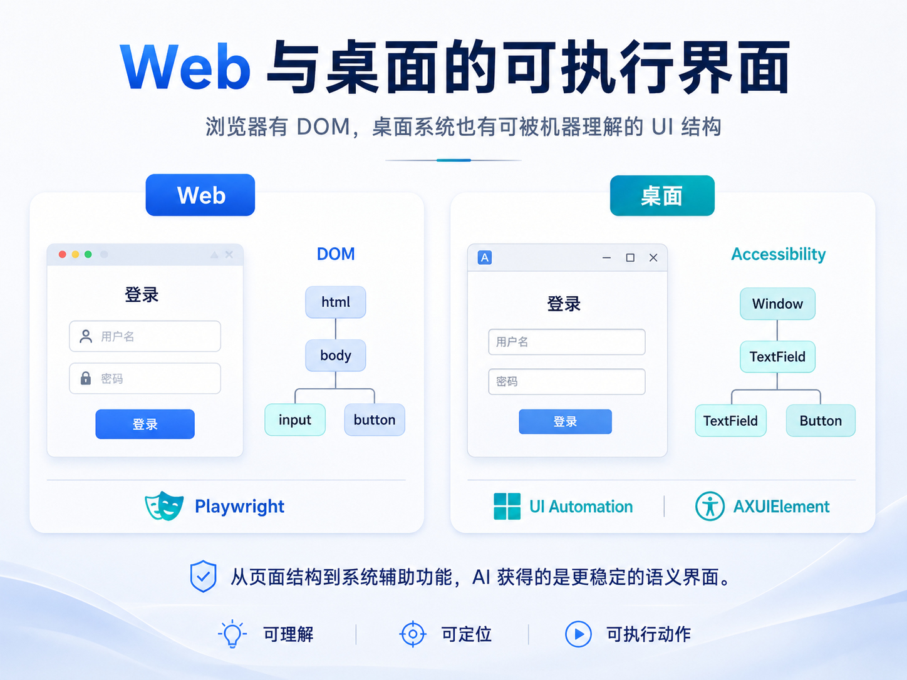
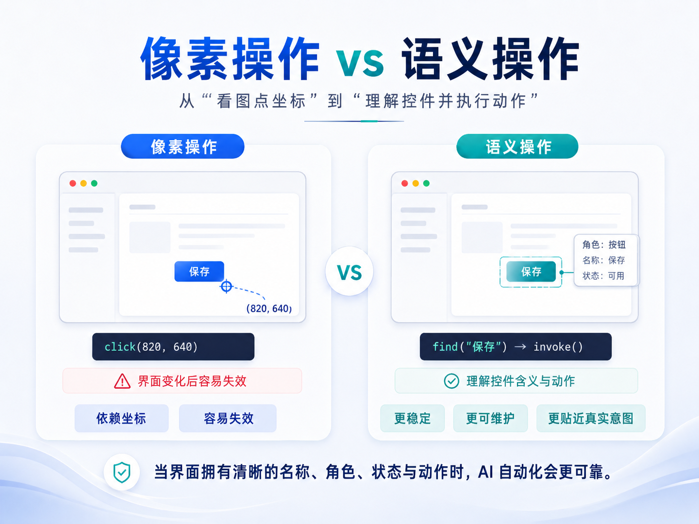
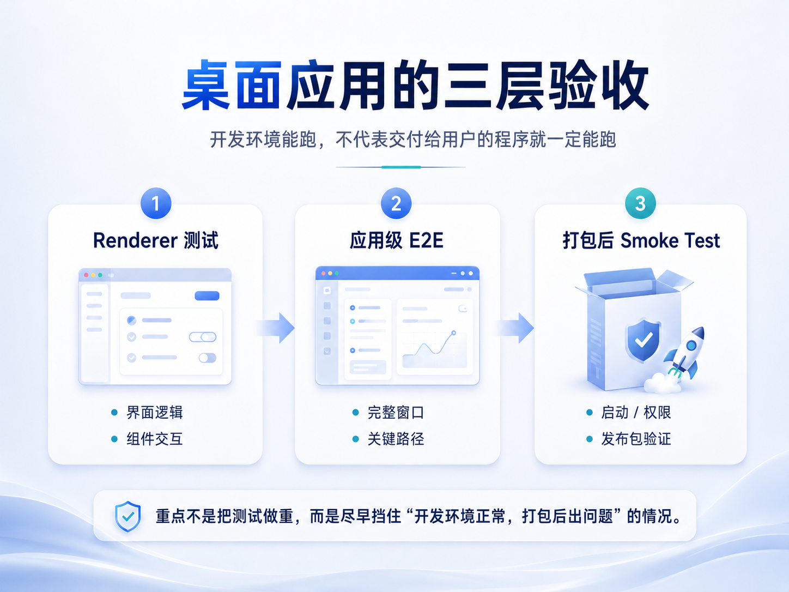

# AI 时代，代码写完不算完成：我为什么开始给项目默认加 E2E

AI 时代做开发，我越来越在意一个问题：**既然代码已经可以大量交给 AI，测试和验收最好也能够闭环。**

我理想中的开发闭环，不是 AI 写完代码以后，人再负责打开页面、逐个按钮检查、发现问题后重新告诉 AI；而是 AI 能继续把项目启动起来，完成真实操作，发现失败，修复，再验证一遍。人应该更多负责定义目标和做最终判断，而不是反复承担这些机械的验收劳动。

所以我现在会把“完成”分成两件事：**代码写完了，和功能被证明做完了。** 前一件事 AI 已经越来越擅长；真正容易缺掉的是后一件事——用户要完成的事情，到底能不能从头走到尾。

这也是我开始重新看待 E2E 的原因。它不只是传统意义上的防回归测试，更像是一层**写给 AI 执行的验收标准**：把“什么叫做完”变成机器可以自己运行和判断的东西。

## AI 需要一条能自己走完的路

自然语言需求可以描述目标，却不能直接告诉机器“怎样证明目标已经成立”。

例如“用户修改设置后，刷新页面仍然保留”。真正的验收其实包含三个东西：一个明确的初始状态、一串用户动作，以及一个最终可观察的结果。E2E 做的，就是把这三件事固化下来：进入设置页 → 修改选项 → 保存 → 刷新 → 检查结果。

这一步看起来只是多了一条测试，实际却把需求从一句描述变成了**可重复执行的状态转移**。AI 不再需要从实现代码里反推“我是不是做对了”，而是可以直接运行验收：失败就定位在哪一步，修改后重新执行，直到外部结果成立。

对 AI 开发来说，我甚至觉得这一点比覆盖率更重要。好的验收应该尽量站在用户可观察的层面：按钮叫什么、操作之后页面出现什么、数据是否真的保存，而不是把测试绑死在组件内部结构或某个函数实现上。这样实现可以继续变化，完成标准却保持稳定。

所以我真正想给 AI 留下的，不是一堆测试文件，而是一条它能够自己走完的闭环：**知道什么算完成，也知道怎样证明。**

## Playwright MCP 和项目里的 E2E，不是一回事

我本地本来就有 Playwright MCP，AI 可以直接打开浏览器、点击、输入、看结果。一开始我也觉得：既然它已经能操作页面，项目里为什么还要再写 Playwright 测试？

实际用下来，两者的边界很清楚。MCP 解决的是**当前这一次怎么操作和调试**。它很适合让 AI 临时探索页面、复现问题，甚至先像用户一样把产品走一遍。

项目里的 E2E 解决的是另一件事：**以后每一次都应该怎样验。** 操作步骤和断言进入仓库以后，就不再依赖某个会话、某个模型，CI 也可以在干净环境里重复执行同一套标准。

所以我现在不会追求大量 E2E。对小项目来说，留下少数几条真正代表产品价值的关键路径更重要。测试的对象不是“页面上有多少按钮”，而是“用户最重要的事情有没有断”。

## 我不想把测试做成重型工程

E2E 很有价值，但我也不想因为 AI 能跑浏览器，就把所有问题都塞进浏览器里解决。

一个纯函数算错了，用 Vitest 很快就能定位；一个组件内部的交互，用组件测试通常也更直接。E2E 真正擅长的是另一类问题：**用户从这里进去，最后到底能不能把事情做完。**

所以我现在反而把测试想得更简单。底层逻辑交给单元测试，比较独立的界面交互按需要做组件测试，只有那些真正跨页面、跨状态、接近实际使用过程的东西，才留给 E2E。

这也意味着它不需要无处不在。一次性 Demo、纯静态页面，甚至产品方向还在频繁推翻时，我不会急着建设一整套测试体系。等项目开始稳定、有了真正需要维护的用户流程，再留下几条最关键的 E2E，通常已经很有价值。

## 最近做桌面应用，我发现系统本身也有“语义界面”

最近测试几个桌面应用时，这个问题又给了我一个意外的启发。

我原本以为这套方法很难从 Web 搬到桌面。浏览器有 DOM，Playwright 可以稳定地找到按钮、输入框和文本；一旦离开浏览器，我下意识觉得 AI 大概只能不停截图，再根据画面和坐标去点。

但真正用起来以后，我发现 macOS 的辅助功能比预想中好用得多。很多界面并不是只能“看见”，系统本身已经提供了一层可以被程序读取的结构。

通过 Accessibility，工具拿到的并不只是坐标，而是角色、名称、状态和值：这是一个 Button，它叫“保存”，当前可用；那是一个 TextField，里面有什么内容。macOS 有 `AXUIElement` 和 Accessibility Inspector；Windows 有 UI Automation，Microsoft 现在甚至直接把这套能力带进了面向 AI Agent 的 `winapp ui`。

这件事对我最大的触动不是又多了一个自动化 API，而是我开始把辅助功能理解成一种**机器与界面之间的语义协议**。浏览器里我们习惯依赖 DOM 和可访问名称定位元素；桌面系统虽然实现不同，本质上也在暴露一层比像素更稳定的结构。

换句话说：**浏览器有 DOM，桌面系统同样有一棵可以被机器理解的 UI 树。**

这也解释了为什么可访问性做得好的应用，往往更容易自动化。相反，如果大量界面都是自绘 Canvas、没有名称和角色的自定义控件，AI 最终还是会退回截图和坐标点击——能用，但脆弱得多。

如果只靠截图，AI 看到的是“坐标 820、640 附近好像有一个按钮”；如果辅助功能信息完整，它得到的则可以是“这里有一个叫保存的 Button”。后者显然稳定得多。

这套能力首先是为无障碍服务设计的，而不是专门为 AI 准备的。但它产生了一个很有意思的副作用：一个应用的可访问性越好，自动化工具和 AI 往往也越容易理解它。

以前我会把 accessibility 当成产品上线前才考虑的问题。现在反而觉得，它正在变成 AI 时代桌面软件的一层机器可读接口。

## 桌面应用还多了一道“打包后的验收”

桌面项目还有一个 Web 项目里没那么明显的边界：**Renderer 能跑，只能证明前端这一层正常；真正交付的是一个和操作系统发生关系的应用。**

打包成 `.app` 或 `.exe` 以后，文件路径、菜单、快捷键、权限、窗口生命周期、签名和系统弹窗都会进入实际运行环境。这里的很多失败并不是业务逻辑 Bug，而是集成边界出了问题，所以在开发服务器里很难提前暴露。

因此我现在会把最后一层 Smoke Test 单独看待。它没必要重新覆盖所有业务逻辑，只需要验证最容易在“打包”这一步改变的东西：程序能不能启动，关键系统能力是否可用，最重要的一条路径能不能在真实发布包里走完。

这其实是在测试另一个失败域：前面的测试保证“代码和功能基本正确”，最后这一层保证“交付物在真实环境里仍然成立”。

## 我真正想留下的不是测试，而是完成标准

现在回头看，我真正想留在项目里的，其实不是 Playwright、Vitest 或某个具体工具，而是一层**不依赖实现者的验收接口**。

代码可以重写，模型可以换，框架也可能升级；但“用户应该完成什么、什么结果才算正确”不应该每次都重新解释。如果这些标准只存在于我的脑子里，那么无论 AI 写代码多快，最后仍然要由我亲自接管验收。

一旦关键标准可以被执行，关系就变了：需求是事实来源，验收定义成功条件，AI 只是负责不断修改实现，直到结果满足它。这样即使换一个模型接手，它面对的也不是一句模糊的“把这个功能做好”，而是一组可以自己运行和收敛的目标。

Web 上，Playwright、Trace 和 CI 已经让这件事很容易落地；桌面上的 Accessibility 和 UI Automation，则说明这条路径并不只属于浏览器。

代码生成会越来越便宜。真正决定 AI 能不能从“写代码的助手”继续往前走的，可能正是这一层：**把人的完成标准变成机器能够执行、观察和证明的东西。**

## 参考资料

- [Apple AXUIElement](https://developer.apple.com/documentation/applicationservices/axuielement_h)
- [Windows UI Automation](https://learn.microsoft.com/en-us/windows/win32/winauto/uiauto-uiautomationoverview)
- [Microsoft winapp ui](https://learn.microsoft.com/en-us/windows/apps/dev-tools/winapp-cli/ui-automation)
