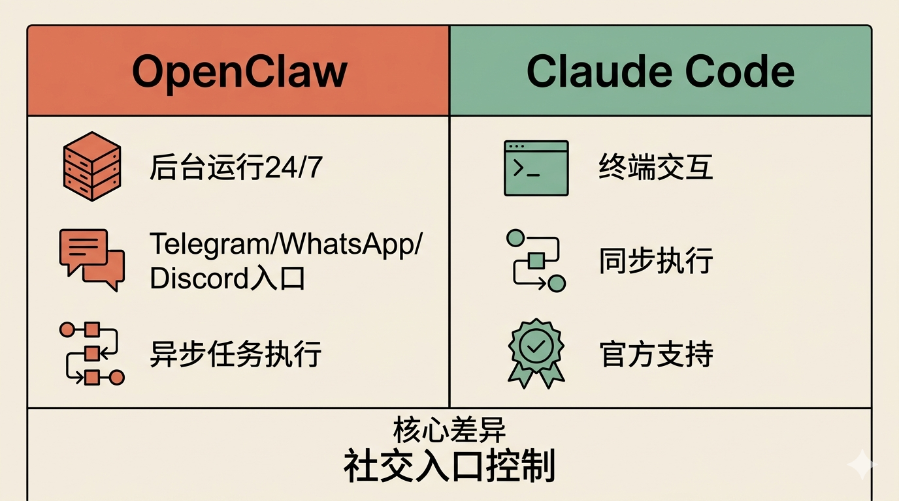
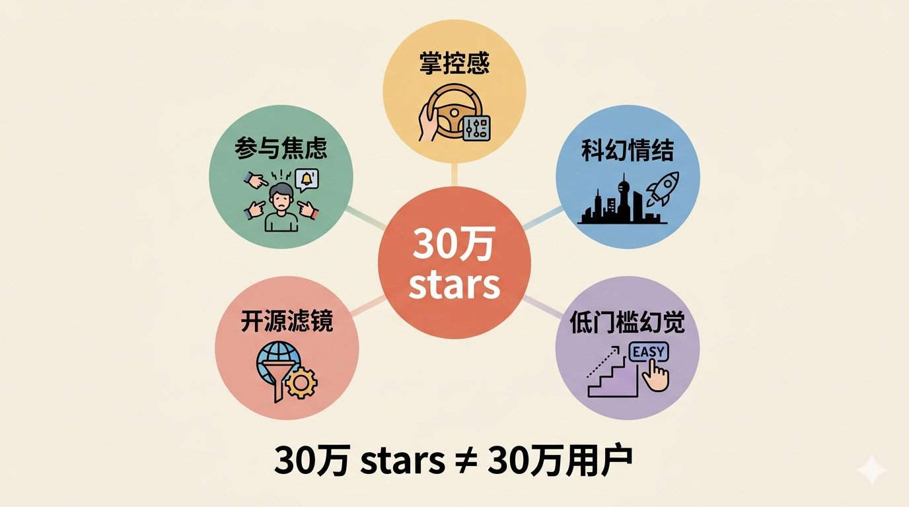

# OpenClaw 真的对你有用吗

30 万 GitHub stars，创始人被 OpenAI 收编负责"下一代个人 Agent"。OpenClaw 看起来很厉害。

**结论先说：大部分人不值得花时间折腾。**

它的核心优势只有一个：通过 Telegram/WhatsApp 控制电脑上的 Agent。除此之外，和 Claude Code 几乎一样。

如果你没有"从手机远程控制 Agent"的刚需，Claude Code 足够。(也有其他专门远程控制替代方案比如happy code)

## 和 Claude Code 相比差在哪

Claude Code 是 Anthropic 官方的 CLI Agent。OpenClaw 能做的——执行命令、读写文件、控制浏览器、调用 API——Claude Code 都能做。

OpenClaw 多出来的：

**后台运行。** Claude Code 需要终端开着。OpenClaw 可以在后台 24/7 跑。

**社交媒体入口。** Telegram、WhatsApp、Discord 发消息就能控制。从手机随时查看状态、发指令。

**异步任务。** 扔给它一个任务，不用盯着，它自己跑完报告结果。

就这些。

如果你主要在电脑前工作，Claude Code 足够。后台运行可以用 tmux 或 nohup 解决。异步任务也可以写脚本实现。

OpenClaw 解决的是"不在电脑前"的场景。问题是——你真的需要随时从手机控制 Agent 吗？

## 为什么火了

时机比产品重要。

2025 年底到 2026 年初，Agent 概念被炒到顶峰。OpenAI、Anthropic、Google 都在推。每个人都在问：我什么时候能有一个自己的 Agent？

OpenClaw 恰好出现，恰好开源，恰好包装得像"个人 Agent"。

但更深层的是大众心理。

**参与焦虑。** AI 浪潮来了，不想被落下。30 万 stars 里，有多少是"先 star 了再说"？点个 star，心理上就"参与"了。不需要真的用，不需要深度理解，一个点击就够了。

**掌控感。** ChatGPT 把数据放在云端。OpenClaw 说"自托管，数据在你自己机器上"。这让担心隐私的人感到安全。但这种安全感有多少是真实的？大部分人没有能力审计代码，只是相信了"自托管 = 安全"的叙事。

**科幻情结。** Telegram 发消息控制 Agent，像科幻电影里的场景。这种"很酷"的感觉，比实际功能更重要。社交媒体上容易传播，因为看起来像未来。

**低门槛幻觉。** 一键安装，不用懂编程。但真正用起来呢？配置 AI provider、调试 Skills、排查问题——门槛在后面等着。很多人装完就放弃了，star 留下了，用户没有。

**开源滤镜。** 开源 = 好，这个心理预设太强了。30 万 stars 很大程度上是"支持开源"的情绪投票，不是对产品能力的认可。

很多人专门买 Mac Mini 24/7 跑 OpenClaw。这更像一种仪式——"我有 Agent 了，我没被落下"。

## GitHub Issues 里的问题

翻了一下 OpenClaw 的 Issues，能看出一些实际痛点：

**安装和升级问题。** Apple Silicon 用户报告架构检测错误。Node.js 升级后 Telegram 无法使用。brew 升级后依赖丢失。

**功能缺陷。** Memory index 会清空数据。多 AI provider 配置时，缺少 API key 会静默回退到其他模型。Discord 通过代理连接失败。消息偶尔重复发送。

**性能问题。** 会话记录太长时，Web UI 会冻结。

这些问题不致命，但说明项目还在快速迭代中。30 万 stars 不代表成熟度——可能是"尝鲜型用户"多，真正深度用的少。

## 什么场景有用

**监控 + 通知。** 监控服务器状态、爬虫报警、价格提醒。这类"长时间运行 + 偶尔触发"的任务，OpenClaw 的异步 + 社交入口组合确实方便。

**远程控制。** 不在电脑前，需要执行一个任务。比如远程重启服务、拉取数据、生成报告。

**非技术用户。** 不想碰命令行，只想在 Telegram 里说"帮我做这个"。

但这些场景，工具替代方案很多。监控用 Uptime Kuma，远程控制用 SSH + tmux，非技术用户用 ChatGPT。

OpenClaw 的优势是"一个入口搞定所有"。代价是配置成本——Skills 生态看着多，真正好用的有限。

## 什么场景没必要

**日常开发。** 写代码、调试、重构——Claude Code 更顺手。你在终端里工作，Agent 也在终端里，上下文切换成本最低。

**复杂任务。** Agent 的可靠性仍然有限。复杂任务需要反复确认、调整方向，同步交互比异步更高效。

**一次性任务。** 只需要跑一次的事情，不值得花时间配置 Agent。

## 值得关注的信号

OpenAI 收购 OpenClaw 团队后，可能推出更强的能力。但就目前而言，OpenClaw 更像是一个"被风口推起来的产品"——它填补了一个真实的细分需求（后台 Agent + 社交入口），但这个需求没有 30 万 stars 看起来那么大。

如果你已经在用 Claude Code，没必要换。如果你没有"随时从手机控制 Agent"的需求，也没必要装。

---