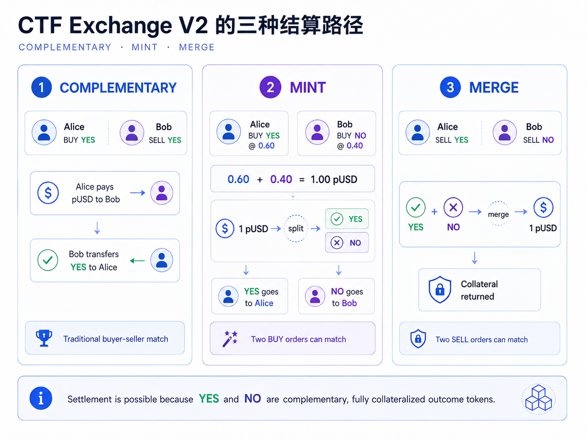
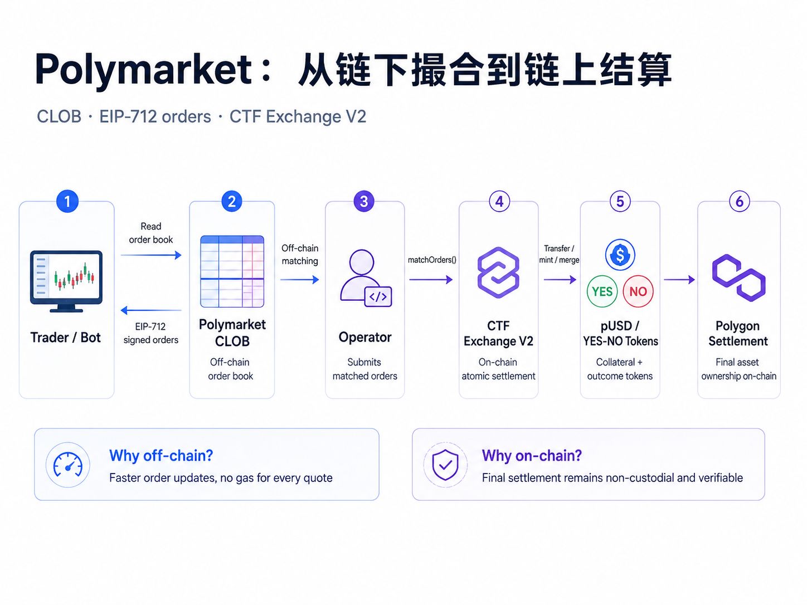
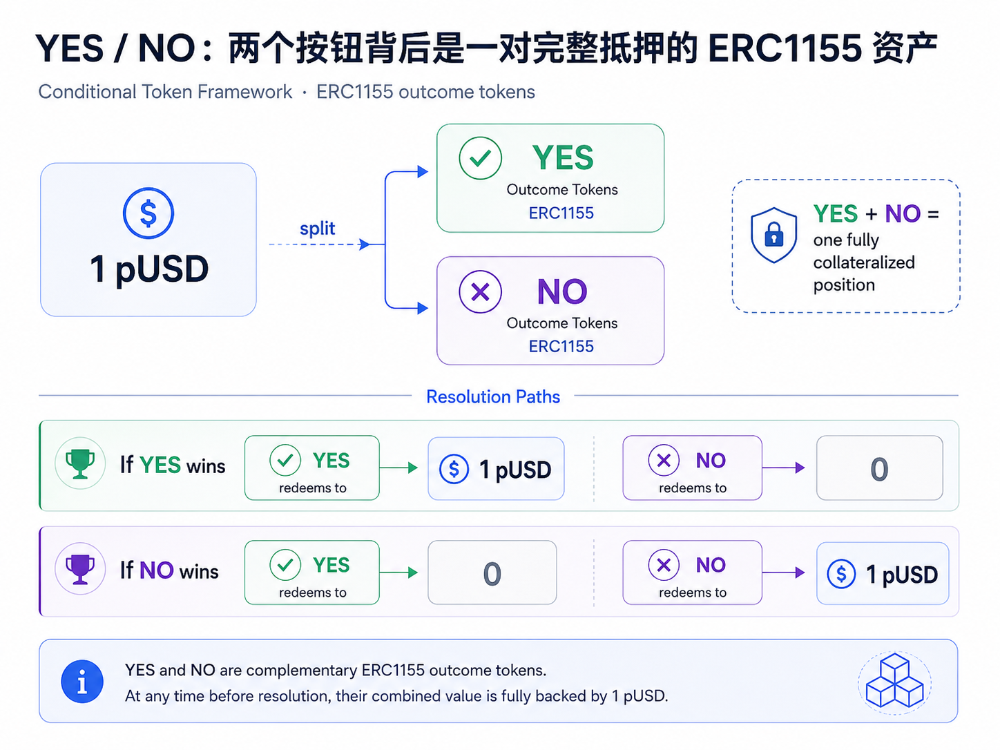
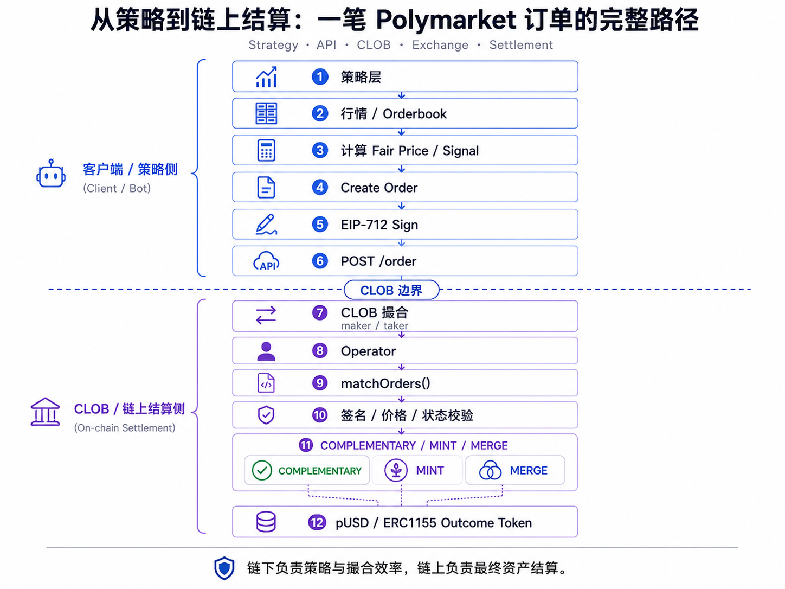

# Polymarket CTF Exchange V2：一笔预测市场订单如何完成链上结算

Polymarket 表面上是一个很简单的交易产品：一个问题，YES / NO 两个方向，一张订单簿。进入结算层后，有三个问题绕不开：**YES 和 NO 在链上究竟是什么资产？没有传统意义上的卖家时，两个 BUY 为什么也能成交？链下 CLOB 又怎样把撮合结果变成链上的最终资产交换？**

这三个问题都落在 Polymarket 当前使用的 **CTF Exchange V2** 上。沿着一笔订单从 CLOB 到链上的路径，可以把核心机制拆成三部分：资产模型、订单授权和结算。

2026 年 4 月 28 日，Polymarket 的 CLOB V2 正式上线。升级不仅替换了 SDK，还同时重写了 Exchange 合约、CLOB 后端和抵押资产体系：旧的 USDC.e 直接结算被 pUSD 抵押层取代，V1 签名订单不再兼容生产环境，Exchange 的 EIP-712 domain 也从版本 `1` 升到了 `2`。[官方迁移说明](https://docs.polymarket.com/v2-migration)

旧 `ctf-exchange` 仓库随后被归档，官方要求新的集成直接参考 V2。[V1 归档仓库](https://github.com/Polymarket/ctf-exchange) · [CTF Exchange V2](https://github.com/Polymarket/ctf-exchange-v2)



## 一、Polymarket 不是“所有事情都上链”的 DEX

Polymarket 官方把 CLOB 描述为一个 **hybrid-decentralized trading system**：订单撮合发生在链下，而成交后的资产交换在 Polygon 上通过 Exchange 合约原子结算。用户签署的是 EIP-712 订单，CLOB 负责维护订单簿和寻找可成交订单，Operator 再把撮合结果提交到链上。[CLOB Overview](https://docs.polymarket.com/trading/overview)



这套设计把两种目标分开了：

- **撮合效率**交给链下 CLOB，不需要每一次挂单、撤单都支付链上 gas；
- **资产所有权与最终结算**交给链上合约，Operator 不能凭空制造一笔用户没有授权的订单。

对于做量化或者交易机器人的开发者，这个边界很重要。我们平时主要面对的是 CLOB API，但 CLOB 并不是最终账本。

## 二、YES / NO：两个按钮背后是一对完整抵押的 ERC1155 资产

Polymarket 页面上最直观的东西，就是 YES 和 NO 两个方向。这个交互看起来极其简单，但协议层的设计其实很巧妙：YES 和 NO 并不是数据库里的两个选项，而是 Polygon 上真实存在的一对 **ERC1155 Outcome Token**，底层基于 Gnosis Conditional Token Framework。[Positions & Tokens](https://docs.polymarket.com/concepts/positions-tokens)



它们最关键的关系非常简单：

```text
1 pUSD
  ↓ split
1 YES + 1 NO
```

市场结束后，如果 YES 胜出：

```text
1 YES → 1 pUSD
1 NO  → 0
```

反过来则 NO 价值 1 pUSD。

因此，一个完整的 `YES + NO` 组合本质上始终对应一份完整抵押。这里最巧妙的地方是：**用户看到的只是两个简单按钮，协议看到的却是一组可以 split、merge、最终 redeem 的互补条件资产。**

这个资产模型不只是为了把预测结果“Token 化”。后面会看到，正是因为 YES 和 NO 之间存在这种严格的互补关系，Polymarket 才能做到两个 BUY 互相成交，或者把一组 YES + NO 重新 merge 回抵押资产。

Polymarket 当前使用 pUSD 作为交易抵押资产；官方合约页给出的 Polygon 主网 pUSD Proxy 地址是：

```text
0xC011a7E12a19f7B1f670d46F03B03f3342E82DFB
```

CTF Exchange V2 地址是：

```text
0xE111180000d2663C0091e4f400237545B87B996B
```

Conditional Tokens 合约地址是：

```text
0x4D97DCd97eC945f40cF65F87097ACe5EA0476045
```

这些地址都可以从 Polymarket 当前的 [Contracts 官方页面](https://docs.polymarket.com/resources/contracts)核对。

## 三、从 API 下单走到 EIP-712：机器人到底签了什么

如果只是通过 SDK 使用 Polymarket，我们通常不会手动碰底层订单结构。官方 V2 SDK 会替开发者完成签名和请求构造：

```typescript
const order = await client.createAndPostOrder(
  {
    tokenID,
    price: 0.50,
    size: 10,
    side: Side.BUY,
  },
  {
    tickSize: "0.01",
    negRisk: false,
  }
)
```

但 SDK 只是把底层细节包装起来了。继续往下看，V2 合约里的 `Order` 结构已经变成：

```solidity
struct Order {
    uint256 salt;
    address maker;
    address signer;
    uint256 tokenId;
    uint256 makerAmount;
    uint256 takerAmount;
    Side side;
    SignatureType signatureType;
    uint256 timestamp;
    bytes32 metadata;
    bytes32 builder;
    bytes signature;
}
```

源码：[Structs.sol](https://github.com/Polymarket/ctf-exchange-v2/blob/main/src/exchange/libraries/Structs.sol)

这里有几个 V2 很明显的变化：V1 中的 `nonce`、`feeRateBps`、`taker` 被移除，增加了 `timestamp`、`metadata` 和 `builder`。官方迁移文档也明确记录了这次签名结构变化。

真正参与 EIP-712 hash 的不是最后的 `signature` 本身，而是前面的订单字段。当前 `Hashing.sol` 把 domain 固定为：

```text
name    = Polymarket CTF Exchange
version = 2
```

然后计算订单的 typed-data hash。[Hashing.sol](https://github.com/Polymarket/ctf-exchange-v2/blob/main/src/exchange/mixins/Hashing.sol)

V2 同时支持 EOA、Polymarket Proxy、Gnosis Safe 和 ERC-1271 四类签名。对新的 API 用户，官方现在主要推荐 deposit wallet + `POLY_1271`。[Signature Types](https://docs.polymarket.com/trading/overview#signature-types)

这也解释了一个常见误区：**L2 API Key 能证明一次 HTTP 请求来自谁，但真正能授权资产成交的仍然是订单本身的 EIP-712 签名。** 官方文档将 API 鉴权和订单签名分成了两层：L1 使用钱包签名创建/派生 API 凭证，L2 使用 HMAC 认证交易请求，而创建订单仍需要用户签署订单 payload。

## 四、真正的入口：`matchOrders()`

V2 把旧版的 `fillOrder()` / `fillOrders()` 移除了，核心结算入口统一为 `matchOrders()`。

当前主合约中的函数签名是：

```solidity
function matchOrders(
    bytes32 conditionId,
    Order memory takerOrder,
    Order[] memory makerOrders,
    uint256 takerFillAmount,
    uint256[] memory makerFillAmounts,
    uint256 takerFeeAmount,
    uint256[] memory makerFeeAmounts
) external onlyOperator notPaused
```

源码：[CTFExchange.sol](https://github.com/Polymarket/ctf-exchange-v2/blob/main/src/exchange/CTFExchange.sol)

这里的 `onlyOperator` 非常关键：普通用户不会直接调用它。用户负责签单，CLOB/Operator 负责把已经撮合好的订单组合提交给 Exchange。

但 `onlyOperator` 并不意味着 Operator 可以随意转走用户资产。进入 `_matchOrders()` 以后，合约仍然要验证订单、tokenId、签名、用户 pause 状态、订单剩余数量以及价格是否满足成交条件。最终可执行范围仍然受到用户签名内容约束。

## 五、最值得看的地方：为什么两个 BUY 也可以成交

CTF Exchange V2 的 `MatchType` 只有三个值：

```solidity
enum MatchType {
    COMPLEMENTARY,
    MINT,
    MERGE
}
```

这三个类型其实把预测市场与普通现货订单簿的差异暴露得很清楚。

### 1. COMPLEMENTARY：普通的买卖双方

例如：

```text
Alice: BUY YES
Bob:   SELL YES
```

这最接近普通交易所：Bob 把 YES Token 给 Alice，Alice 支付 pUSD。

### 2. MINT：两个 BUY 可以互相撮合

假设：

```text
Alice: BUY YES @ 0.60
Bob:   BUY NO  @ 0.40
```

乍看两个人都在买，没有卖家。但 YES 与 NO 的价格刚好凑成完整的 1 pUSD：

```text
Alice 0.60 pUSD ─┐
                 ├─ 1 pUSD → split → YES + NO
Bob   0.40 pUSD ─┘                ↓      ↓
                                Alice   Bob
```

因此 Exchange 可以通过 CTF **mint/split 一套新的 Outcome Token** 完成交易。

这不是额外发行没有抵押的资产。恰恰相反，正因为 YES + NO 对应完整的 1 pUSD 抵押，两个互补 BUY 才能组成一笔闭合交易。

### 3. MERGE：两个 SELL 也可以互相撮合

反方向同样成立：

```text
Alice: SELL YES
Bob:   SELL NO
```

如果 Exchange 同时拿到完整的 YES 与 NO，它可以把一套 Outcome Token merge 回 collateral：

```text
YES + NO → merge → 1 pUSD
```

这就是 Polymarket 合约最值得研究的一点：**订单簿看起来像普通 BUY / SELL，但结算层理解的是“完整条件资产组合”。**

官方 V2 README 和 `Trading.sol` 都明确实现了 `COMPLEMENTARY / MINT / MERGE` 三条路径。[V2 README](https://github.com/Polymarket/ctf-exchange-v2/blob/main/README.md) · [Trading.sol](https://github.com/Polymarket/ctf-exchange-v2/blob/main/src/exchange/mixins/Trading.sol)

## 六、继续读源码，会看到几个很典型的生产级设计

### OrderStatus 被压在一个 storage slot

V2 的订单状态不是两个 `uint256`：

```solidity
struct OrderStatus {
    bool filled;
    uint248 remaining;
}
```

`bool + uint248` 正好可以放进 256 bit storage slot。订单状态是高频读写数据，这种设计的目标很直接：减少不必要的 storage 成本。

### 多个 maker 的 mint / merge 会批处理

`Trading.sol` 在处理多个 maker 时，不是遇到一个订单就立刻 split/merge 一次。源码先累计 `totalMintAmount` 和 `totalMergeAmount`，之后再执行批量 CTF 操作，然后进入分发阶段。

这意味着 V2 不只改了接口，它在结算路径里显式考虑了 **multi-maker transaction 的 gas 成本**。

### 事件发射也做了底层优化

`Events.sol` 没有只依赖最直接的 Solidity `emit` 写法，而是预先计算 event topic，并使用 assembly 构造部分日志数据。[Events.sol](https://github.com/Polymarket/ctf-exchange-v2/blob/main/src/exchange/mixins/Events.sol)

不过这里有一个写技术文章时值得注意的细节：V2 README 对部分 helper 的描述可能落后于当前 `main`。例如 README 曾把 `CalculatorHelper` 描述为 assembly-optimized，但当前主分支的 `CalculatorHelper.sol` 已经非常短，只保留普通的乘除计算。所以分析生产合约时，**README 可以作为地图，但最终结论应该回到当前源码。**

类似地，V2 上线迁移文档记录的是 Solidity 从 0.8.15 升到 0.8.30；而当前 `main` 的 `CTFExchange.sol` 已经使用 `pragma solidity 0.8.34`。这也说明公开仓库在上线后仍持续演进。

## 七、把 API 经验和链上结算连起来

从机器人开发视角，一笔交易可以分成两套完全不同的系统：



我认为这是理解 Polymarket API 最重要的一层补充：如果只会调用 `getOrderBook()` 和 `createAndPostOrder()`，我们理解的是**交易接口**；把 `matchOrders()`、CTF 和 collateral layer 一起看，才真正理解了这套系统的**结算模型**。

对于量化机器人来说，这也直接影响工程判断。例如：

- `tokenId` 不只是 API 中的市场标识，它最终对应 ERC1155 position；
- API 的 order status 与链上 `OrderStatus` 属于不同层级的问题；
- 交易失败不一定只是“API 请求失败”，也可能发生在签名、余额、授权、价格 crossing 或链上结算条件；
- 做库存和做市时，YES/NO 的 split / merge 不是外围功能，而是资金效率的一部分。

## 八、一笔真实 Polygon 交易留下了什么

官方合约地址并不是只存在文档里。PolygonScan 上可以直接观察 `0xE111...996B` 的实际结算事件。

例如交易：

[0xd67e955fca9ee74809b18df15d3d253127f0ac837d0e8d101921ba75eb19fed2](https://polygonscan.com/tx/0xd67e955fca9ee74809b18df15d3d253127f0ac837d0e8d101921ba75eb19fed2)

PolygonScan 解码出了来自 **Polymarket: CTF Exchange V2** 的 `OrdersMatched` 事件，其中包含：

```text
takerOrderHash
maker / taker related address
side
tokenId
makerAmountFilled
takerAmountFilled
```

同一笔交易还可以看到 `OrderFilled` 数据中的 `fee`、`builder`、`metadata` 等字段。

这与 V2 的 `ITrading.sol` / `Events.sol` 定义能够对应起来。也就是说，从 API 里提交的抽象订单，最终确实会落成 Polygon 上可验证的交易与事件日志。

这一节目前只做到 **event-level verification**。如果后续作为正式 Portfolio 文章发布，我会继续选择一笔结构清晰的交易，把 calldata、maker/taker、ERC20/ERC1155 Transfer、CTF mint/merge 与最终余额变化完整 trace 一遍，而不是为了“看起来完整”虚构一条链路。

## 九、这套架构真正解决的是什么

拆完以后，Polymarket 的核心并不神秘：它把一个预测市场拆成了几层彼此边界清晰的系统。

CLOB 负责撮合效率；EIP-712 负责用户授权；Exchange 负责原子结算；Conditional Token Framework 负责条件资产表达；pUSD 提供抵押层。

这些组件组合在一起后，前端仍然可以保持接近传统 Order Book 的交易体验，但最终成交对应的资产所有权会落到链上。API 和交易机器人解决的是下单与执行问题，Exchange、CTF 和抵押层则决定订单成交后资产如何被创建、交换、合并和赎回。

## 暂不展开的部分

以下三个主题属于相邻但不同的协议层，这里暂不展开：

1. **NegRisk**：多结果、互斥市场如何在多个二元市场之间提高资本效率；
2. **Oracle / Resolution**：市场结果如何经过 UMA 等机制判定并最终允许 Redeem；
3. **完整链上 Trace**：选取一笔真实交易，对 calldata、事件和余额变化逐层还原。

它们更适合单独成为后续文章。
