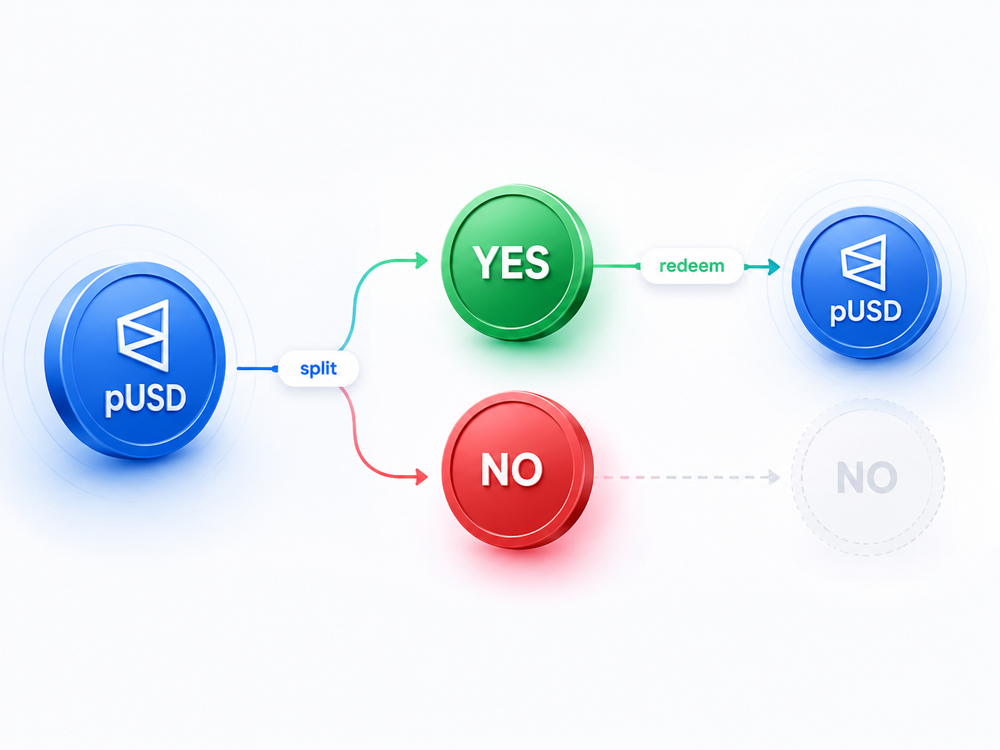
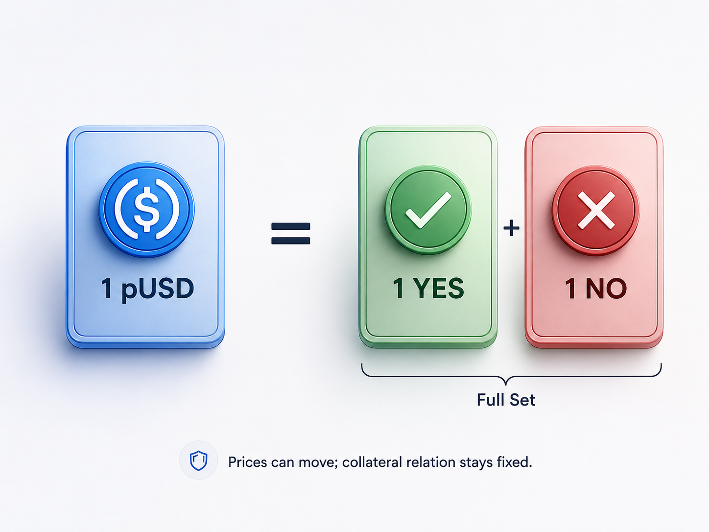
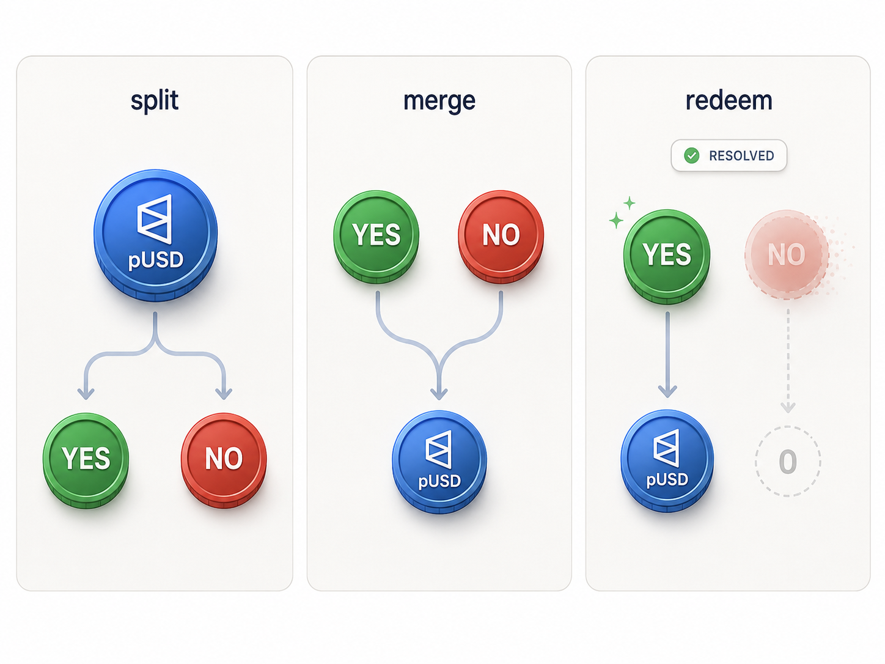
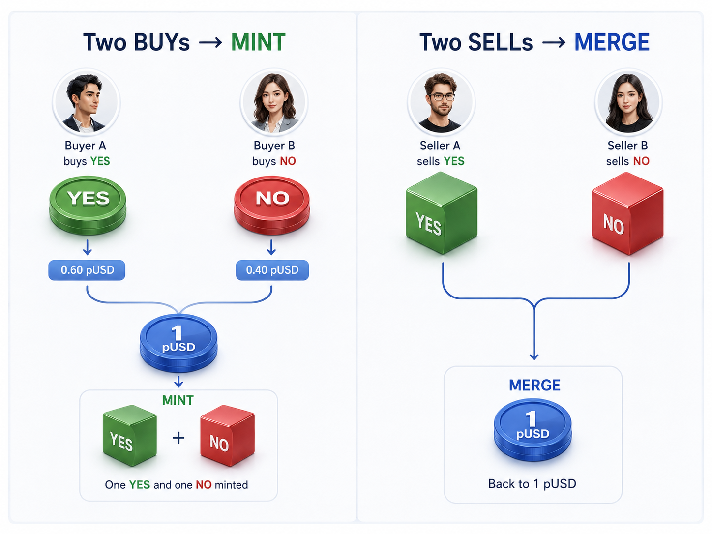

# Polymarket 双 Token：YES / NO 如何运转

我第一次真正觉得 Polymarket 这套设计很巧，不是在看订单簿，而是在处理 YES / NO 这两种资产的时候。

我之前在 Polymarket 上写过量化交易机器人，也做过一个类似的预测市场。站在策略和系统实现两个角度再回头看，会发现它的“双 Token”并不是把一个简单问题搞复杂了，反而是把很多原本需要单独处理的逻辑统一了。

页面上的 YES 和 NO 看起来只是两个交易方向，链上却是两种真实的 ERC1155 Outcome Token。一个二元命题被拆成两种可以独立持有、交易和转移的资产，同时又保持 **1 pUSD ↔ 1 YES + 1 NO** 的完整抵押关系。

市场结束前，完整的一套 YES + NO 可以 `merge` 回 pUSD；结果确定后，再由 `redeem` 按 payout 结算胜负。也就是说，从资产生成、交易中的库存管理，到最终结算，始终围绕同一套 Token 模型展开。这个统一性，是我觉得它最漂亮的地方之一。



## 一、YES / NO 为什么要做成两种 Token

Polymarket 把每个市场的 YES / NO 做成 ERC1155 Outcome Token，底层沿用 Gnosis Conditional Token Framework（CTF）。这样不需要为每个市场分别部署一套 ERC20，大量市场的 position 可以共用同一份合约，再通过 `tokenId` 区分。

一个 Outcome Token 最终由 condition、outcome collection 和 collateral 一起确定；算出来的 `positionId`，就是 ERC1155 的 `tokenId`。这也是为什么两个市场即使都叫 YES，链上仍然是两种完全不同的资产。

**conditionId：这是什么条件**

CTF 中，一个 condition 由 oracle、questionId 和 outcome 数量确定：

```solidity
conditionId = keccak256(
    abi.encodePacked(oracle, questionId, outcomeSlotCount)
);
```

二元市场的 `outcomeSlotCount` 是 2。合约并不关心页面上显示的标题是不是“YES / NO”，它只管理两个 outcome slot 以及最终对应的 payout。

**collectionId：选中了哪些 outcome slot**

CTF 用 `indexSet` 表示 outcome 子集。二元市场通常就是 `0b01` 和 `0b10`；它们与 YES / NO 的对应关系由市场元数据决定，再和 `conditionId` 一起形成对应的 collection。

**positionId：真正的 ERC1155 tokenId**

最后，CTF 把抵押资产和 collection 组合成 position：

```solidity
positionId = uint256(
    keccak256(abi.encodePacked(collateralToken, collectionId))
);
```

源码对这个值的注释很直接：**position ID is the ERC1155 token ID**。到这里，页面上的 YES / NO 就不再只是两个方向，而是可以被持有、转移和撮合的真实链上资产。

## 二、完整抵押关系：1 pUSD 对应一套 YES + NO

Polymarket 当前使用 pUSD 作为交易抵押资产。官方文档给出的关系很直接：**1 pUSD 对应一套 1 YES + 1 NO**，每一套完整组合都由 CTF 中锁定的 collateral 支持。

这里最容易混淆的是抵押关系和市场价格。YES 可以交易在 0.63，NO 可以交易在 0.38，但这不代表它们分别锁着对应金额的 pUSD。价格由订单簿决定；合约真正固定的是 **1 YES + 1 NO 可以组成一个 full set，并对应 1 pUSD collateral**。

因此市场价格怎么波动，都不会改变底层的 full-set 关系。



## 三、split / merge / redeem：资产如何闭环

### split：锁入 pUSD，同时生成一整套 Outcome Token

最简单的例子就是：把 100 pUSD `split` 进去，会得到 100 YES 和 100 NO。底层对应 CTF 的 `splitPosition()`。

对于普通二元 root position，可以把这次调用理解成：collateral 是 pUSD，`parentCollectionId` 为 0，`conditionId` 指向当前市场，`partition` 是 `[0b01, 0b10]`，`amount` 是 100。当 partition 覆盖完整 outcome set 时，`splitPosition()` 做两件核心事情：

1. 从调用者转入 `amount` 的 collateral；
2. 为 partition 中的每个 position mint 同样数量的 ERC1155 token。

结果就是用户少了 100 pUSD，CTF 多锁了 100 pUSD，同时 YES 和 NO 各 mint 100。这里没有“凭空创造价值”。Outcome Token supply 增加的同时，CTF 里也多锁入了等量 collateral。

这对做市尤其重要。做市商如果需要同时持有 YES 和 NO 库存，不必分别从市场上买两边，可以直接把 pUSD split 成一整套 Outcome Token。

### merge：销毁完整集合，把 collateral 取回来

`mergePositions()` 基本就是 split 的反方向操作。

假设地址里同时有 100 YES 和 100 NO，并且它们来自同一个 condition、同一个 collateral，那么这套完整集合可以直接 merge 回 100 pUSD。合约内部会 `_batchBurn()` 对应 position，再把等量 collateral 转回调用者。资产变化正好和 split 相反：两边 Outcome Token supply 各减少 100，CTF 释放 100 pUSD。

因此 merge 并不是“在订单簿里卖掉 YES 和 NO”。它不需要对手方，也不依赖当前盘口，只要求调用者自己持有等量、可组成完整集合的 Outcome Token。

这给 inventory management 多出了一条路径：如果策略过程中同时积累了 YES 和 NO，不一定要分别挂单卖出；完整部分可以直接 merge 回 collateral。

### redeem：市场有结果后按 payout 结算

`redeem` 和 `merge` 很容易被混在一起，但它们解决的是两个不同阶段的问题。

**merge 不要求市场已经 resolution。** 它依赖的是“我是否持有完整集合”。

**redeem 则必须等 condition 已经有 payout。** CTF 的 `redeemPositions()` 开头就检查：

```solidity
uint den = payoutDenominator[conditionId];
require(den > 0, "result for condition not received yet");
```

也就是说，在 oracle 结果还没有写入 condition 之前，不能走最终 redemption。

函数签名为：

```solidity
function redeemPositions(
    IERC20 collateralToken,
    bytes32 parentCollectionId,
    bytes32 conditionId,
    uint[] calldata indexSets
) external
```

这里还有一个容易忽略的细节：`redeemPositions()` 没有传 `amount`。它会读取调用者在指定 position 上的 `balanceOf`，计算 payout 后，把对应余额 burn 掉。

对于最简单的二元结果，如果 payout 是 `[1, 0]`，100 YES 最终可以兑回 100 pUSD，100 NO 则归零；如果 payout 是 `[0, 1]`，结果反过来。

CTF 的计算并不是在代码里写死“YES = 1、NO = 0”，而是把 position 对应的 `indexSet` 与 condition 的 `payoutNumerators` 组合起来计算最终 payout。这让同一套框架可以处理不止二元 YES / NO 的条件资产。

### 三种操作的区别

把交易界面拿掉，只看资产层，这三个函数非常清楚：

| 操作 | Outcome Token | Collateral | 关键条件 |
| --- | --- | --- | --- |
| `split` | mint | 锁入 CTF | 有效 partition |
| `merge` | burn | 从 CTF 取回 | 持有完整集合 |
| `redeem` | burn | 按 payout 释放 | condition 已 resolution |

所以 `split / merge / redeem` 并不是三个“交易 API”。它们直接改变 Outcome Token 的 supply 与 CTF 中的 collateral 状态。

普通 BUY / SELL 则是另一层：用户通过 CLOB 交易 position，而 Exchange 在结算时根据订单组合选择直接 transfer，或者利用完整条件资产的结构走 MINT / MERGE 路径。



## 四、最巧的地方：两个 BUY 也能成交

前一层 Exchange 里有个一开始很反直觉的现象：两个 BUY 也能彼此成交。

比如一个人愿意用 0.60 pUSD 买 YES，另一个人愿意用 0.40 pUSD 买 NO。传统直觉会问：卖家在哪里？但在这套资产模型里，两边加起来刚好是 1 pUSD，可以直接形成一套完整抵押，再 mint 出一枚 YES 和一枚 NO 分给双方。

两个互补 SELL 也是同一件事的反方向。YES 和 NO 一旦重新凑成完整集合，就可以一起 burn，释放底层 collateral。

这也是我做交易机器人时觉得很有意思的地方。策略看到的是两个盘口、两个价格和各自的库存，但底层并不是两套互不相干的资产。**YES + NO 始终有机会重新回到一个完整的 1 pUSD。**

这会直接影响做市和库存管理。机器人如果同时积累了两边仓位，不一定非要分别找对手盘退出；完整部分可以直接 merge。反过来，需要双边库存时，也可以从 collateral split 出来，而不是先在市场里把两边都买齐。

我自己做类似预测市场时也会遇到同一个问题：如果 YES / NO 只是数据库里的方向标记，撮合、持仓、结算、库存回收往往会长成几套不同的逻辑。Polymarket 的做法更干净——先把结果变成资产，后面的交易系统围绕资产规则工作。

所以 CTF Exchange V2 里的 `MINT / MERGE` 并不是为了撮合而额外设计的一套技巧，它只是把 Conditional Token 原本就存在的 full-set 关系利用到了结算层。订单簿和链上资产因此没有被硬生生拆成两套世界。



## 五、做过机器人和预测市场后，我怎么看这套设计

我自己做过类似预测市场以后，反而更能体会这种资产模型的价值。

如果 YES / NO 只是数据库里的两个方向，撮合、持仓、结算、库存回收很容易各自长出一套逻辑。Polymarket 先把结果变成真实资产，再让订单簿、做市和结算围绕这套资产关系工作，系统边界会干净很多。

对量化机器人也是一样。策略表面上盯的是两个盘口，底层却始终知道 YES 和 NO 可以组成 full set。库存因此不只有“买”和“卖”两种处理方式，还多了 split 和 merge 这两条路径。

这也是我觉得双 Token 最巧的地方：**它不是为了链上而链上，而是用一套资产关系，把交易、库存和结算统一到了一起。**
