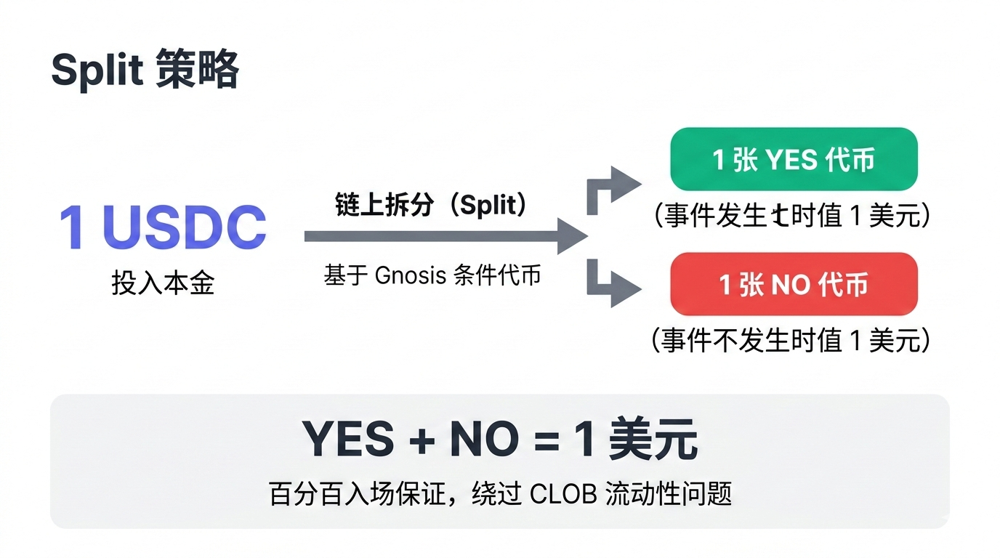
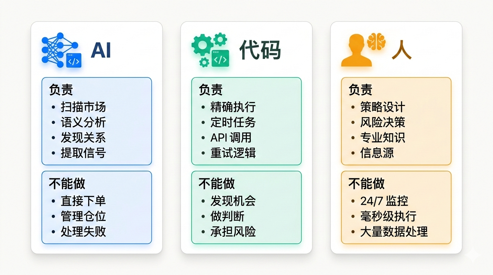

# OpenClaw 能交易 Polymarket 吗：AI Agent 在预测市场的边界

2026 年 1 月底，OpenClaw 爆火。一个月后，创始人 Peter Steinberger 加入 OpenAI，负责"下一代个人 Agent"。

很多人问：能不能用 OpenClaw 在 Polymarket 上交易？

**能。** 已经有人用 OpenClaw + Polymarket 单周赚了 $115K。

但怎么做到的？门槛在哪？这篇文章拆开讲。

## OpenClaw 能做什么

OpenClaw 是一个自托管的个人 AI 助手。你通过 Telegram、WhatsApp、Discord 发消息给它，它能：

- 执行命令、读写文件、控制浏览器
- 在后台 24/7 异步运行
- 自动监控、自动执行、自动报告

爆火的原因不是技术突破，而是需求被点燃了：人们想要一个"能在后台自己跑的 Agent"，数据在自己机器上，从手机就能控制。

Mac Mini 销量跟着涨。很多人专门买一台 24/7 运行。

OpenClaw 本身是个执行框架，支持 Skills 插件。交易 Polymarket 的能力，来自社区已经写好的 Skills——你不需要从零开始。

## Polymarket 上能赚多少钱

Polymarket 官方 Newsletter 最近采访了几个顶级交易者。

RememberAmalek 在 NYC 市长选举中赚了 $300K。入场点是 Zohran Mamdani 胜率只有 8% 的时候。策略：高确信的方向性押注。

Doomberg 是个匿名团队，成员是前大宗商品高管。他们用能源市场的专业知识预测地缘政治事件。

Belikewater 预测了以色列对伊朗的打击。她现在给 Khamenei 15% 的概率在 2025 年下台。

> 注：这些数字来自 The Oracle by Polymarket，是 Polymarket 官方的交易者访谈系列。

FlyPix 报道的案例：OpenClaw + Polymarket 单周赚 $115K。这是做市商策略，在市场双方挂单赚买卖价差。

## Split 策略：保证入场的自动化方法

Polymarket 基于 Gnosis 的 Conditional Tokens Framework。有一个特性叫 Split：把 1 USDC 拆成 1 YES + 1 NO token。

无论结果如何，你一定有一边值 $1。

这带来一个优势：**保证入场**。

传统做法是在订单簿挂买单，等成交。流动性差的市场可能永远成交不了。Split 是链上交易，100% 成功——你先拿到票，再卖掉不需要的那边。

AI Agent 可以自动执行这个流程：
1. 监控目标市场
2. 自动调用 Split 合约
3. 自动挂单卖出不需要的 token
4. 报告执行结果

Chainstack 的 PolyClaw 项目已经展示了实现方式。OpenClaw 可以调用这类脚本，全程自动化。

## AI 能自动化什么

**市场筛选。** AI 可以扫描成百上千个市场，找出跨市场对冲机会。比如：特朗普是否赢得大选 vs 共和党是否赢得大选——如果 A 发生，B 一定发生。这是逻辑蕴涵，AI 能自动识别。

**新闻监控。** AI 可以 24/7 监控新闻源，发现可能影响市场的事件，自动推送提醒。

**执行自动化。** Split 策略、挂单撤单、仓位管理——这些都可以写成脚本让 Agent 自动执行。

**报告生成。** 每天自动汇总盈亏、持仓、市场变动，推送到你的手机。

**人只需要做什么？**

设定策略方向。比如"专注选举市场"、"做市商策略"或"跨市场对冲"。这是你的判断，AI 帮你执行。

## 实际入门路径

**第一步：熟悉市场。** 在 Polymarket 上手动交易几笔，理解订单簿、赔率、结算机制。

**第二步：尝试自动化。** 用 Chainstack 的 PolyClaw 或社区开源的 Skills，在测试网跑一遍流程。

**第三步：小额实盘。** 从 $100-$500 开始，让 Agent 自动执行，观察结果。

**第四步：优化迭代。** 根据执行日志调整策略，逐步放大规模。

FlyPix 建议做市商策略的启动资金 $5,000-$10,000。但方向性交易、跨市场对冲可以从更小的金额开始。

## 需要注意的坑

**Cloudflare 封锁。** Polymarket 的 CLOB API 有 Cloudflare 保护，部分 IP 会返回 403。解决方案：住宅代理、自动重试、或用 Split 策略绕过 CLOB。这些都可以写成自动化脚本。

**监管风险。** CFTC 在关注预测市场的自动化交易。确保你了解当地法规。

**策略失效。** 任何策略都有生命周期。市场会学习、会调整。需要持续监控、持续优化。

## 值得关注的信号

- OpenAI 收购 OpenClaw 团队后，可能推出更强大的 Agent 能力
- Polymarket 用户量和流动性持续增长，机会窗口在扩大
- 社区 Skills 生态在快速成熟，门槛在降低

---

**参考来源：**
- The Oracle by Polymarket：顶级交易者访谈
- FlyPix：OpenClaw + Polymarket $115K/周案例分析
- Chainstack PolyClaw：Split 策略开源实现
- Gnosis Conditional Tokens Framework
