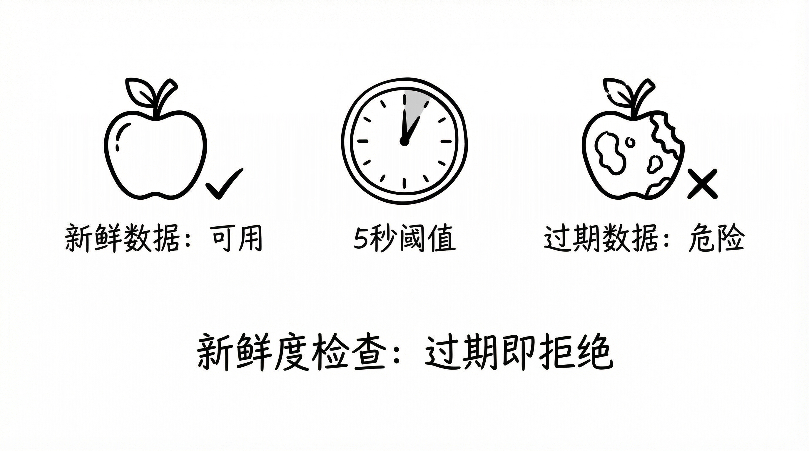
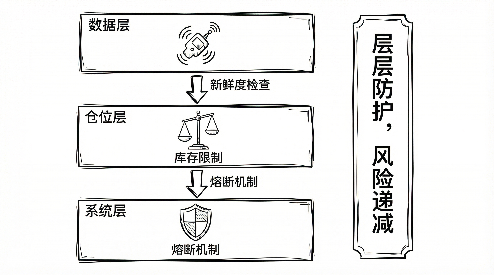

# Polymarket 量化交易实战（十）：风险管理实战

**活得久，比赚得多更重要。**

策略决定你赚什么，风控决定你能不能继续做下去。

很多人把风控放到最后补。实盘里应该反过来：每一轮下单前先过风控。

先说明一下：文里的数字都是示例，不是固定标准。你的账户大小、市场波动、下单速度不一样，参数就该不一样。

## 数据风控：先保证你看到的是“现在的盘面”



高频里最先要防的，不是方向看错，而是数据过期。

常见做法是给行情加一个“保质期”。超过时间就不下单。

```python
# 示例参数，不是固定最优值
MAX_STALE_MS = 5000.0

if (now - ts > MAX_STALE_MS):
    logger.warning("Data stale, SKIP")
    return
```

`5000ms` 只是常见量级，不是必须用这个数。

你可以这样理解：

- 想做得更稳，就把时间设短一点。  
- 想减少误杀，就把时间设长一点。

除了时间，还建议再加两条简单检查：

- 盘口是不是只剩一边报价。  
- 买一价是否大于等于卖一价（这种盘面通常不正常）。

## 价格风控：不做“看起来成交、实际不赚钱”的单

我们做的是价差，不是为了成交而成交。

源码里常见两条保护：

- 某一边价格太高（比如超过 `0.95`）就不追。  
- 两边买入价加起来太高（比如超过 `0.98`）就不做。

示例：

```python
# 示例参数，需按费率/滑点/市场类型调整
if raw_ask_yes > 0.95 or raw_ask_no > 0.95:
    return

if (price_yes + price_no) > 0.98:
    return
```

判断标准也可以更白话：

做完这一单，扣掉手续费和滑点后，剩下的钱太少，那就别做。

## 仓位风控：单边越来越重时，要主动纠偏



双边策略最怕的不是没成交，而是仓位越做越歪。

源码里常见的写法：

```python
diff = abs(pos_yes - pos_no)
if diff > 30:
    # 只允许库存更少的一侧继续挂单
```

这段逻辑很好理解：

- 先看 Yes 和 No 的持仓差。  
- 差太大，就只补少的那一边。  
- 差回到安全区，再恢复双边挂单。

把这三步跑稳，仓位风险会降很多。

## 执行风控：很多亏损发生在“下单过程”

实盘里常见的问题不是观点错，而是执行出问题：

- 撤单慢，旧挂单还在场上。  
- 部分成交后没更新仓位，又继续同向下单。  
- 限频或网络抖动，导致节奏乱掉。

所以风控不能只有 `return`。更好的做法是有动作分级。

## 风控联动：异常出现后，要有分级动作

很多策略触发风控后只是“这轮跳过”。这只能止一口血，不够。

更实用的是分四步处理：

- 轻度异常：先降频，减少换单和追价。  
- 中度异常：缩量，把每笔风险压小。  
- 重度异常：单边停单，只做回补。  
- 持续异常：全停并报警，等人工确认。

还有一个细节很关键：恢复门槛要比停单门槛更严格。

例如触发是“连续 5 秒数据不新鲜”，恢复可以设成“连续 30 秒稳定”。

这样能避免系统在边界附近来回抖。

## 参数怎么调：先保守，再放开

参数调优不用复杂，按这条顺序就够：

先用保守参数上线，跑一段稳定样本，再一点点放开。

不要一开始就开很激进，再靠运气补洞。

## 风控不是刹车，是方向盘

短期看，风控会让你少做一些单。

长期看，它帮你挡掉的是一批“做了大概率会后悔”的单。

真正拉开差距的，不是你抓住多少机会，而是你躲开多少明显不该做的交易。
