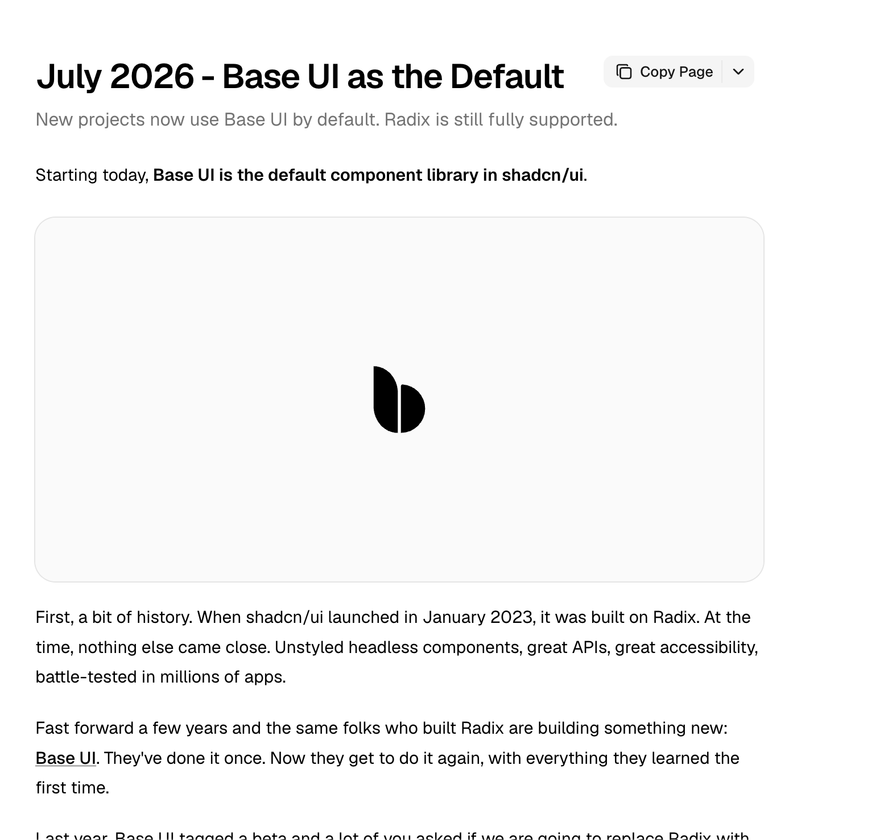
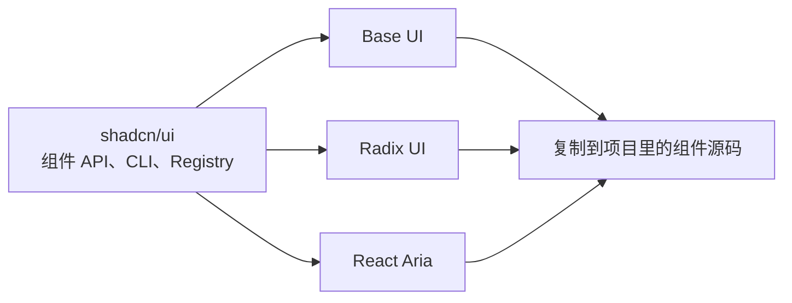
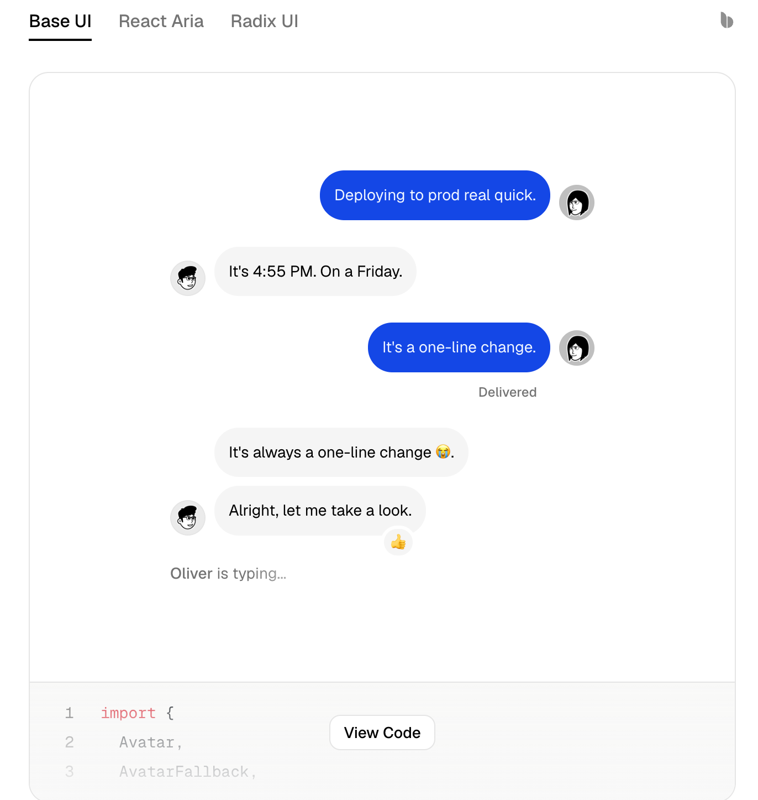

# shadcn/ui 默认改用 Base UI，我一开始以为 Radix 被放弃了

我最近在给一个新项目确定技术栈。

UI 这一项，我原本很自然地写成了：

```text
shadcn/ui（Radix UI）
```

过去几年，这几乎已经成了一种固定搭配。提到 shadcn/ui，很多人首先想到的就是 Radix Primitives、Tailwind CSS，以及一套可以直接复制到项目里修改的组件代码。

但我后来发现，这个写法已经不完全准确了。

2026 年 7 月，shadcn/ui 把 **Base UI 设成了新项目的默认底层组件库**。组件文档默认展示 Base UI 版本，运行初始化命令时，默认生成的也不再是过去熟悉的 Radix 版本。

我看到这个变化时，第一反应和很多人差不多：

**shadcn/ui 是不是准备放弃 Radix 了？**

毕竟，一个项目把默认方案换掉，通常意味着它认为新的方案更适合未来。再加上 Base UI 和 Radix 做的事情看起来非常接近，很容易把这件事理解成一次替代。

我去看了一遍官方公告和两边的文档，最后发现事情没有这么简单。



## 改了默认项，不等于 Radix 被弃用

这次变化只影响新项目的默认选择。

如果还是想用 Radix，可以在初始化时明确指定：

```bash
pnpm dlx shadcn init -b radix
```

已经使用 Radix 的项目也不会被自动切换。以后继续添加组件时，shadcn 仍然会按照项目原来的底层实现生成对应代码。

官方对这一点说得很明确：Radix 仍然完整支持，现有项目没有必要为了追随默认值而迁移。shadcn 自己也还有基于 Radix 的生产项目，而且没有计划把这些项目全部改成 Base UI。

这对我来说很重要。

因为 shadcn/ui 不是普通的黑盒组件依赖。它会把组件源码放进项目的 `components/ui`，开发者通常还会继续改样式、补属性，甚至调整组件结构。一个项目只要做过这些定制，所谓“迁移底层组件库”就绝不是改一下 `package.json` 那么简单。

Radix 中常见的 `asChild`、`data-state`、CSS 变量和事件行为，都可能已经进入项目自己的组件代码。仅仅因为新项目的默认项变了，就把这些代码全部重写，收益很难覆盖成本。

所以我现在的判断很简单：

**旧项目该怎么跑就继续怎么跑。默认值的变化，主要是给新项目看的。**

## Base UI 为什么能成为默认

既然 Radix 没出什么严重问题，shadcn 为什么还是把 Base UI 放到了前面？

官方给出的几个数字很有意思。

在公告发布时，Base UI 已经到了 1.6.0，每周下载量超过 600 万。shadcn 团队新启动的项目都在使用 Base UI；在此前允许用户自由选择的 shadcn/create 中，新项目选择 Base UI 和 Radix 的比例大约是 2:1。

也就是说，shadcn 并不是突然决定强推一套没人用的新方案。它先让两套实现并存了一段时间，等自己的新项目和社区里的新项目都明显偏向 Base UI 以后，才顺势调整默认值。

我更在意的其实不是下载量，而是 Base UI 最近在补什么组件。

Radix 的 Dialog、Popover、Dropdown Menu、Tooltip 和 Select 已经非常成熟。这些也是它过去最吸引人的地方。但现在做一个完整的 SaaS、AI 产品或者管理后台，常用的交互已经不只是一组弹窗和菜单。

Combobox、Autocomplete、Number Field、Drawer、OTP Field，以及更完整的 Field 和 Form，都会频繁出现。Base UI 对这类现代应用组件的覆盖更积极，更新速度也更快。

这并不能证明 Radix 的组件不够好。更准确的说法是：

**Radix 的优势是经典组件已经足够成熟；Base UI 的优势是还在快速向外扩展。**

对于默认选项来说，shadcn 不只要考虑今天哪些组件稳定，也要考虑以后新增组件时，底层库能不能及时提供对应能力。

## 它们的差别，不只是换了一个名字

Base UI 不是凭空出现的竞争对手。

它的团队背景和 Radix、Material UI、Floating UI 都有联系，整体理念也非常接近：组件本身不预设视觉风格，但负责可访问性、焦点管理、键盘操作和复杂的交互状态，开发者再在上面建立自己的设计系统。

所以我更愿意把 Base UI 理解成一次带着已有经验重新设计的机会，而不是对 Radix 路线的否定。

两者最直观的区别之一，是组件组合方式。

Radix 常见的是 `asChild`。`DialogTrigger` 不再额外渲染一个按钮，而是把触发行为交给里面的 `Button`：

```typescript
<DialogTrigger asChild>
  <Button>打开设置</Button>
</DialogTrigger>
```

Base UI 对应的写法是 `render`，要替换成什么元素，直接写在属性里：

```typescript
<DialogTrigger render={<Button />}>
  打开设置
</DialogTrigger>
```

我一开始觉得，这好像只是把一个属性换成了另一个属性。但 Base UI 的 `render` 还可以使用函数形式，直接读取组件当前状态：

```typescript
<Switch.Thumb
  className={(state) =>
    state.checked ? "translate-x-5" : "translate-x-0"
  }
/>
```

状态样式的写法也不一样。Radix 组件里经常能看到：

```typescript
className="data-[state=open]:animate-in"
```

Base UI 更常见的是：

```typescript
className="data-open:animate-in"
```

这些代码都直接写在文章里，比截一张代码图片更容易看清，也方便读者复制。

当然，这些差异还没有大到足以让普通项目立刻迁移。如果业务代码主要使用 shadcn 封装好的 `Dialog`、`Select` 和 `Button`，两套实现的使用体验其实很接近。只有在修改 `components/ui`、开发复杂组件，或者自己做 Registry 时，底层 API 的差别才会明显暴露出来。

## 真正改变的，是 shadcn/ui 对自己的定义

查完这些资料后，我觉得最值得关注的并不是 Base UI 和 Radix 谁赢了。

真正变化的是 shadcn/ui 本身。

以前我会把它理解成 Radix 上面的一层组件代码和样式方案。这个理解在早期没有太大问题，因为绝大多数组件确实建立在 Radix 之上。

但现在，shadcn/ui 已经同时提供 Base UI、Radix，后来又加入了 React Aria 版本。它正在尽量让这些不同的底层实现，共用相似的组件名称、CLI、Registry、Blocks 和使用方式。

这意味着 shadcn/ui 想稳定下来的，不再是某一个 Primitive 库，而是它自己的组件分发体系。





底层可以是 Base UI，也可以是 Radix 或 React Aria；开发者最终拿到的，仍然是一份放在自己项目里、可以继续修改的组件源码。

所以，与其说 shadcn/ui 放弃了 Radix，不如说它正在摆脱另一个更旧的印象：

> shadcn/ui 就等于 Radix UI。

这也是为什么我以后不会再只写 `shadcn/ui`，然后默认所有人都知道项目底层是什么。

技术栈文档里最好明确写成：

```text
shadcn/ui（Base UI）
```

或者：

```text
shadcn/ui（Radix UI）
```

## 对 AI 开发来说，这件事反而更麻烦

我现在很多项目都会让 AI 参与实现，因此这次变化还有一个很实际的影响。

AI 很容易把不同时期的 shadcn 代码混在一起。

它可能一边生成 Base UI 的组件，一边继续写 Radix 的：

```text
asChild
data-[state=open]
--radix-popover-content-available-height
```

也可能在原本的 Radix 项目里突然塞进：

```text
render={<Button />}
data-open
```

这些代码单独看都可能是正确的，但放错项目以后，就会出现类型报错、状态样式失效，或者组件行为对不上文档的问题。

以前只写“使用 shadcn/ui”可能就够了。现在最好把底层实现也写进 PRD、技术架构和执行提示词里。

例如新项目可以明确要求：

```text
UI 使用 shadcn/ui，底层采用 Base UI。
不要生成 Radix 专用的 asChild、data-state 或 Radix CSS 变量。
```

旧项目则反过来：

```text
当前项目使用 shadcn/ui + Radix UI。
保持现有 Radix API，不主动迁移到 Base UI。
```

这可能比纠结两个库谁更先进更有用。因为大多数项目真正遇到的问题，并不是选择错了，而是选定以后又被混入了另一套写法。

## 我最后会怎么选

现在再开新项目，我会直接用 Base UI。不是因为 Radix 不能用，而是 shadcn/ui 已经把它设为默认，文档和后续组件都会更顺手。

已经用 Radix 的项目，我不会动。能正常跑，就没有必要为了换默认项再迁移一次。

以后我只会在技术栈里写清楚：`shadcn/ui（Base UI）`，或者 `shadcn/ui（Radix UI）`。这样 AI 写代码时也不容易把两套 API 混在一起。

## 参考资料

- [shadcn/ui：Base UI as the Default](https://ui.shadcn.com/docs/changelog/2026-07-base-ui-default)
- [shadcn/ui：Base UI Documentation](https://ui.shadcn.com/docs/changelog/2026-01-base-ui)
- [shadcn/ui：React Aria](https://ui.shadcn.com/docs/changelog/2026-07-react-aria)
- [Base UI：About](https://base-ui.com/react/overview/about)
- [Base UI：Releases](https://base-ui.com/react/overview/releases)
- [Radix Primitives：Releases](https://www.radix-ui.com/primitives/docs/overview/releases)
