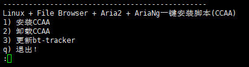
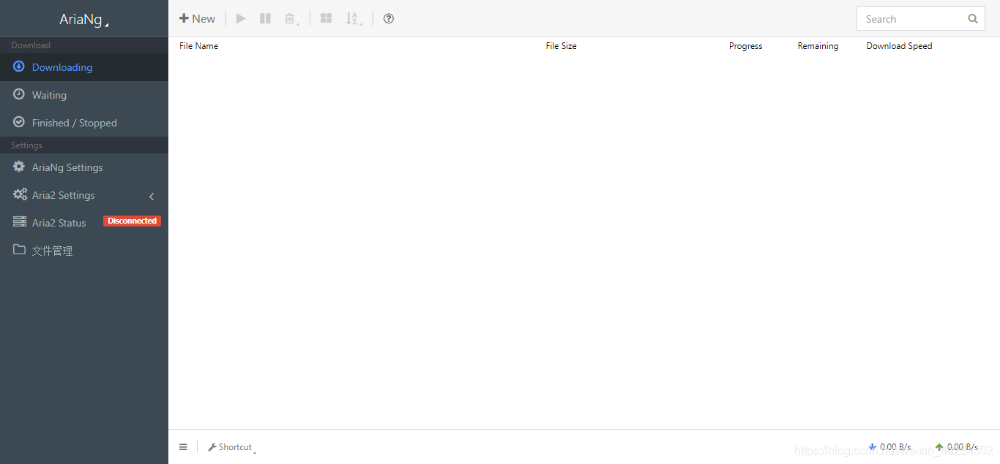
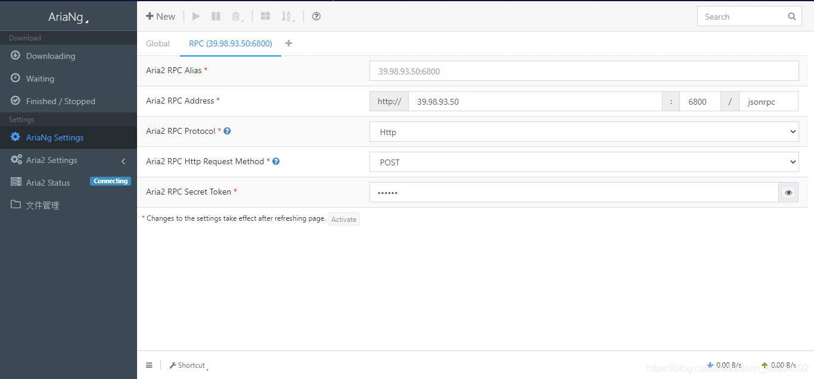
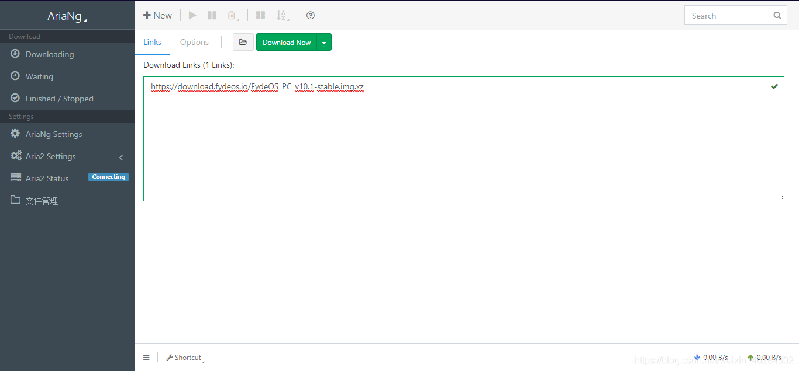

# CCAA 打造离线下载服务器

### 一、 安装 CCAA(CentOS + Caddy + AriaNg + Aria)

#### 1.1 在服务器输入以下命令：

_#海外_

```
 bash <(curl -Lsk https://raw.githubusercontent.com/helloxz/ccaa/master/ccaa.sh)
```

_#国内_

```
bash <(curl -Lsk https://raw.githubusercontent.com/helloxz/ccaa/master/ccaa.sh) cdn
```



输入 1，回车开始安装

#### 1.2 填写相关信息

安装完毕后会提示访问地址、Aria2 RPC 密钥、File Browser 用户名、密码，记录保存.

#### 1.3 在服务器安全组设置里开放 6080 端口

#### 1.4 访问刚才提示的访问地址



#### 1.5 设置 RPC 密匙



#### 1.6 管理 CCAA

```
#进入CCAA管理界面* ccaa

*#查看ccaa状态* ccaa status

*#启动ccaa* ccaa start

*#停止ccaa* ccaa stop

*#重启ccaa* ccaa restart

*#查看当前版本* ccaa -v
```

## 二、开始使用

#### 2.1 新建下载



​ END
<Valine></Valine>
