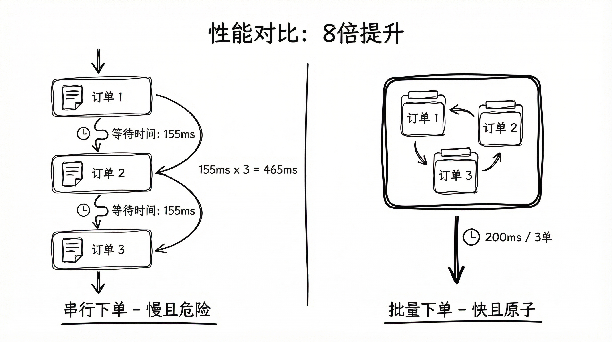

# Polymarket 量化交易实战（四）：批量下单与优化

做交易系统，经常会看错问题。

表面看是“下单不够快”，实质是“状态不一致”。

串行下单就是这个误区最典型的样子：

```python
# 串行发送两条腿
await self.place_order(yes_token)
await self.place_order(no_token)
```

这段代码能跑，但实盘里有两个后果几乎必然出现：

1. 延迟翻倍：两次请求、两次 RTT。
2. 仓位暴露：第一条腿成交、第二条腿失败，瞬间单边。

说白了，这不是“体验差一点”，而是策略风险模型被撕开了一道口子。

这篇只解决一件事：把下单从串行改成批量，并把回包状态当状态机来处理。

## Batch 解决的，不只是速度



Polymarket CLOB 提供了批量下单接口：`POST /orders`，单次最多 `15` 单。

很多人把 Batch 理解成“节省请求数”。这只说对了一半。

另一半更关键：一篮子订单更接近同一时刻进入系统，腿间错位会明显收敛。

简单看一下差异：

- 串行：签名 + 网络往返，重复 N 次
- 批量：签名还是 N 次，但网络往返压成 1 次

在做市里，这不是锦上添花，这是生存项。

还有一个常见误解：Batch 不是原子事务。它返回逐单结果，天然会出现“部分成功、部分失败”。

如果系统设计默认 all-or-nothing，线上迟早出事故。

## 官方接口最容易漏掉的 4 个点


下面这 4 条，不复杂，但很致命。

1. `orderType` 必须和策略目标一致  
   `FOK / FAK` 偏吃单，`GTC / GTD` 偏挂单。类型选错，后面所有统计都失真。

2. `postOnly` 只适用于 `GTC / GTD`  
   和 `FOK / FAK` 组合会报 `INVALID_POST_ONLY_ORDER_TYPE`。

3. 不要只看 `success`  
   还要看 `status` 和 `errorMsg`。`delayed` 的语义不是“失败”，而是“接受了，但执行时序延后”。

4. `status` 必须进入状态机  
   `matched / live / delayed / unmatched` 对应的是四种后续动作，不是四种日志文案。

补一个经常被忽略的细节：如果直接走 REST，`PostOrder` 里要带 `owner`（API key），否则会被拒绝。

【注：官方错误列表里有 `ORDER_DELAYED`、`MARKET_NOT_READY` 等场景。建议单独建监控，不要混在普通失败里。】

## 为什么早期阶段我更倾向“全撤全挂”

交易系统会越来越复杂，这件事几乎不可避免。

但复杂度应该长在策略上，不应该长在一坨难以维护的订单状态机上。

如果一开始就做“原地改单”，你要同时扛：部分成交、撤单竞态、回包乱序、改单失败重试。很多团队就是在这一层把系统拖慢的。

所以早期我一般会用 `Cancel-All-Then-Place`：

```python
async def tick(self):
    # 1) 清理当前挂单
    await self.cancel_all_orders()

    # 2) 重新计算目标报价
    new_orders = calculate_strategy()

    # 3) 批量提交
    await self.place_orders_batch(new_orders)
```

代价是配额消耗高一些。

换来的是边界清晰、排障直接、行为可预测。

我对这个取舍的态度很明确：**宁可多花配额，也不要把系统拖进不可控状态机。**

等策略稳定、监控完善，再逐步引入“部分改单”，这时优化才是正收益。

## 批量接口示例（Python）

官方 SDK 的典型流程是：先 `create_order`，再 `post_orders([...])`。

```python
from py_clob_client.client import ClobClient
from py_clob_client.clob_types import OrderArgs, OrderType, PostOrdersArgs
from py_clob_client.order_builder.constants import BUY, SELL

host = "https://clob.polymarket.com"
client = ClobClient(host, key=PK, chain_id=137)
client.set_api_creds(client.create_or_derive_api_creds())

orders = [
    PostOrdersArgs(
        order=client.create_order(OrderArgs(
            price=0.52,
            size=80,
            side=BUY,
            token_id=yes_token_id,
        )),
        orderType=OrderType.GTC,
    ),
    PostOrdersArgs(
        order=client.create_order(OrderArgs(
            price=0.48,
            size=80,
            side=SELL,
            token_id=no_token_id,
        )),
        orderType=OrderType.GTC,
    ),
]

resp = client.post_orders(orders)
for r in resp:
    # 建议至少处理这些字段
    # r.success / r.errorMsg / r.status / r.orderId
    handle_post_result(r)
```

这里建议做一件小事：每条回包都落库，关联策略批次 ID。

线上查问题时，这个信息几乎是救命的。没有它，讨论很容易退化成“我感觉是网络问题”。

## 网络层优化：Keep-Alive 默认开启

如果你有一部分请求是自己发 REST，不是全走 SDK，连接复用应该作为默认配置。

```python
import requests

session = requests.Session()
session.mount("https://", requests.adapters.HTTPAdapter(
    pool_connections=20,
    pool_maxsize=20,
))
```

这不是高级优化，但通常能稳定改善尾延迟抖动。

低成本、高收益，不开反而奇怪。

## 上线前检查清单

1. 单次 batch 数量是否严格 `<= 15`
2. `postOnly` 是否只在 `GTC / GTD` 下使用
3. 是否逐单处理 `success + status + errorMsg`
4. `ORDER_DELAYED / MARKET_NOT_READY` 是否有重试或降级
5. 是否记录 `orderId`、策略批次 ID、发送时间、回包时间

下一篇进入复盘：哪些设计应该坚持，哪些该换，哪些还不到时机。
