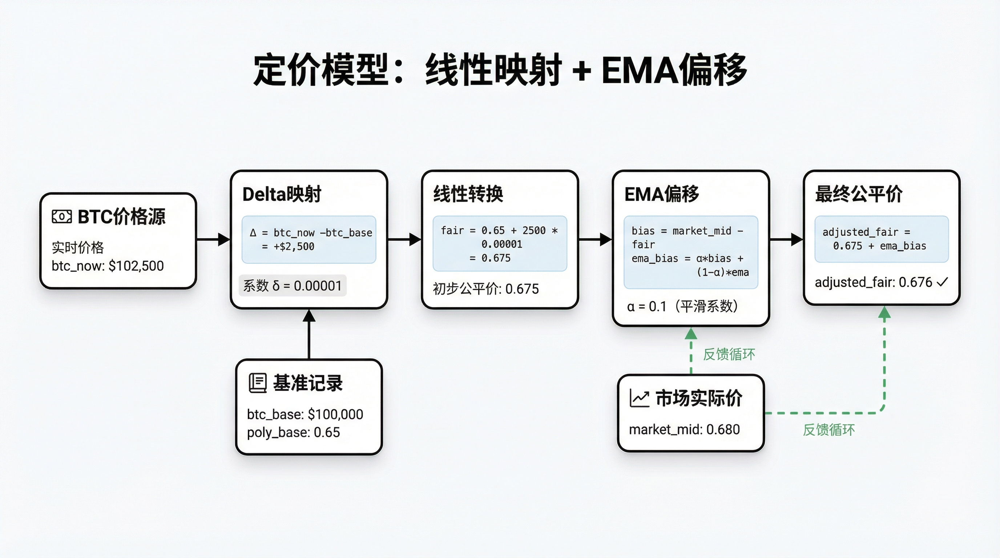
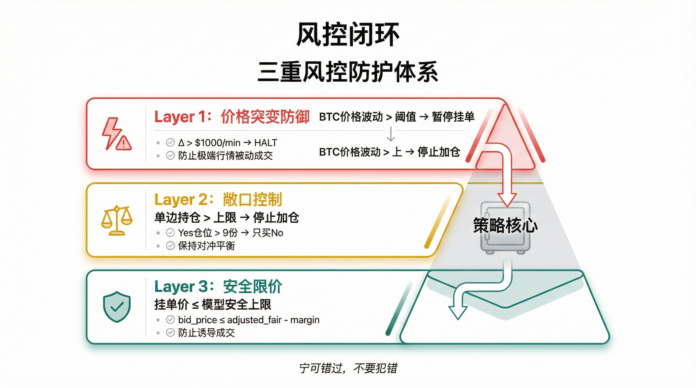

# Polymarket 量化交易实战（九）：币安价格驱动的套利策略

**当两个市场看同一件事，却给出不同的价格，机会就来了。**

预测市场有个结构性特征：**流动性稀疏，价格反应慢**。

尤其是和主流资产相关的事件市场（比如 BTC 价格区间），外部市场的信息变化极快，但预测市场的盘口常常滞后。这就形成了天然错价——币安已经反映了新信息，Polymarket 还没跟上。

策略的本质不是预测未来，而是让预测市场"同步"外部信息，在错价出现时锁定收益。


#### 1. 为什么用币安作为外部定价

币安适合做"参考价"，原因很直接：

*   **流动性极高**：买卖瞬间反映真实价格变化
*   **盘口变化频繁**：能给出实时中间价
*   **直接关联**：对加密资产相关的事件市场，币安价格就是最直接的先导信号

#### 2. 价格源：如何获得实时中间价

策略的第一步，是拿到稳定、低延迟、持续更新的价格。

常见做法是 **"REST 初始化 + WebSocket 实时更新"**：

```python
# 1. 启动时 REST 拉取初始盘口
resp = requests.get("https://api.binance.com/api/v3/ticker/bookTicker",
                     params={"symbol": "BTCUSDT"})
bid, ask = float(resp["bidPrice"]), float(resp["askPrice"])
mid_price = (bid + ask) / 2

# 2. WebSocket 订阅 bookTicker 持续更新
# wss://stream.binance.com:9443/ws/btcusdt@bookTicker
```

这样既有初始基准价，后续更新延迟也极低，适合捕捉瞬时错价。

#### 3. 定价模型：用币安变化推导"合理价"

只知道币安价格还不够。关键是把它映射到预测市场的合理区间。

一个极简但有效的方法：在某个时刻同时记录 BTC 价格 `btc_base` 和预测市场当前 mid `poly_base`，当 BTC 价格变动时，用线性系数 `delta` 估算预测市场应变化的幅度：

```python
fair_price = poly_base + (btc_now - btc_base) * delta
```

**`delta` 的意义**：BTC 每波动 1 美元，预测市场价格理论上该变化多少。它不需要非常精准，只要"方向正确 + 合理尺度"即可。

**动态偏移：让模型适应"结构性偏差"**

预测市场通常会长期偏离一个小幅度，比如长期偏高 2-3 分。

处理方式是引入**动态偏移**：记录当前市场价与模型价的差值，用指数滑动平均（EMA）把偏差不断吸收进模型：

```python
# EMA 吸收结构性偏差
bias = market_mid - model_fair
ema_bias = alpha * bias + (1 - alpha) * ema_bias
adjusted_fair = fair_price + ema_bias
```

这样模型不会因为长期偏差频繁触发错误信号，而是逐步"学习"市场的真实基准。



#### 4. 触发逻辑：什么时候才算机会

模型给出了公平价，真正的问题是：**什么时候值得下单？**

一种稳健的触发规则是 **安全价 vs 当前盘口**：

```python
safe_buy = adjusted_fair - margin  # 安全买入价 = 公平价 - 安全边际

# 只有当安全价显著高于当前最优买价时，才触发
if safe_buy - best_bid > threshold:
    execute_buy()
```

好处很直接：避免在噪声区间频繁下单，只抓**明显错价**的机会。

#### 5. 双边挂单：不依赖方向的套利结构

预测市场的优势在于"二元结构"，套利的核心在于 **合并价值 = 1**。

做法是同时买入 Yes 与 No，控制两边总成本低于 1（例如 0.80），未来通过合并或事件结算回到 1。

**用 0.80 的成本，合成价值 1.00 的头寸。**

不需要判断事件方向，只需要市场的错价足够明显。

> **注意**：使用 `place_orders_batch` 批量发送两边订单，减少单腿成交风险。但批量下单不是原子操作，仍需在代码中处理部分失败的情况。


#### 6. 风控设计：为什么能活下来

套利策略最大的风险不是"没有机会"，而是"在错误时机执行"。

**价格突变防御**：币安价格瞬间大幅跳动超过阈值时，立即停止某一侧挂单，避免极端行情中被动成交。

**敞口控制**：某一侧持仓过多，说明对冲不足，暂停加仓，避免方向风险扩大。

**安全限价**：所有挂单价格不能超过模型的安全上限，防止被"诱导成交"。

在预测市场里，防御往往比进攻更重要。很多套利策略不是输在策略本身，而是输在缺乏风控的"意外事件"上。



#### 7. 实盘细节：延迟与执行是关键

双边套利能否成功，常常取决于执行细节：

*   **延迟**：机会窗口可能非常短，行情源与下单链路必须足够快
*   **并行下单**：两边必须同时发出，防止单腿成交
*   **撤单策略**：不要频繁撤单，否则容易被高频对手捕捉到"撤单信号"，也增加不必要的操作成本

这些细节决定了策略能不能在真实市场里跑得久。

#### 8. 可扩展方向

这个体系可以继续迭代：

*   **多交易所合成价格**：提高定价稳定性
*   **动态 delta**：让模型自动适应波动率变化
*   **盘口深度因子**：不仅看最优价，还考虑深度和成交量
*   **套利强度分级**：小错价轻仓，大错价重仓

#### 总结

整套逻辑串起来就是五个环节：

**价格源 -> 定价模型 -> 触发逻辑 -> 双边下单 -> 风控闭环**

核心只有一件事：用外部信息差，在预测市场的错价窗口里锁定收益。

与前面系列文章中的"纯做市策略"不同，这套策略引入了外部信号源，从"被动提供流动性"进化为"主动捕捉错价"。两者可以互补：做市赚 Spread，套利赚 Mispricing。
