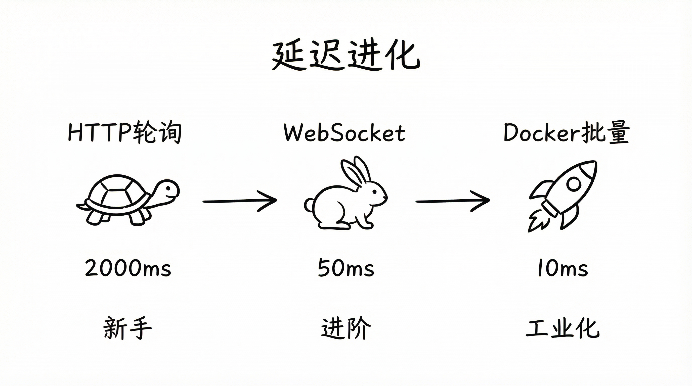
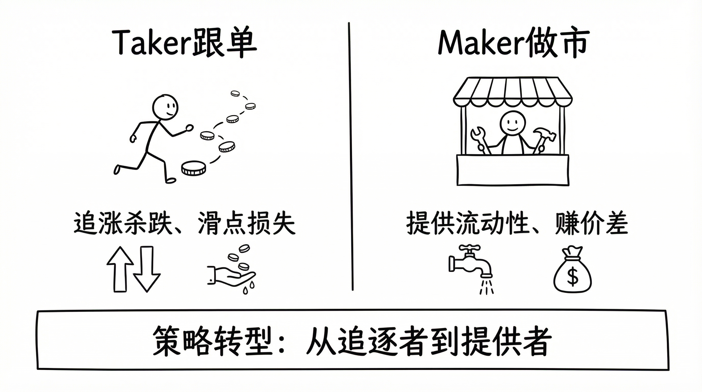

# Polymarket 量化交易实战（五）：Bot 开发纪实

很多人把这类项目理解成“把策略写出来就行”。

真正跑过实盘后会发现，策略只是起点。真正决定生死的是三件事：**数据是否新鲜、状态是否一致、失败能不能自动收敛**。

这篇不讲大而空的心路历程，只讲 5 个版本里最关键的技术决策。

## 阶段一：跟单幻想（V1）



V1 很朴素：轮询大户地址，看到买单就跟。

```python
# V1 思路（简化）
while True:
    trades = requests.get(data_api).json()
    if whale_bought(trades):
        place_market_order()
    time.sleep(1)
```

问题不是“代码不优雅”，而是这套模式在微观结构上站不住：

1. 轮询延迟固定存在，天然慢一步。
2. 市价跟单把定价权交给盘口，滑点不可控。
3. 信号和执行解耦，最终成交价往往不是看到的价格。

V1 的教训很直接：**在预测市场里，慢不是体验问题，是盈亏问题**。

## 阶段二：切到 WebSocket（V2）

V2 的变化看起来是“Pull -> Push”，本质是把系统从“定时器驱动”改成“事件驱动”。

延迟下来了，但马上遇到更难的问题：本地 book 和下单时刻的真实 book 可能不同步。

所以 V2 之后，核心不再是“如何收到更多消息”，而是“如何拒绝不可信数据”。

## 阶段三：从 Taker 到 Maker（V3）



这一步是策略层面的分水岭。

- 跟单（Taker）：赌方向，吃滑点。
- 做市（Maker）：不赌方向，吃价差。

真正改变 PnL 曲线的，不是某个神奇参数，而是角色切换：从“价格接受者”变成“流动性提供者”。

从这一版开始，系统目标也变了：不再追求“猜对下一根”，而是追求“稳定重复的价差回收”。

## 阶段四：工程化，不是“多写点代码”（V4）

V4 的核心不是加功能，而是加约束。

没有约束的交易系统，盈利只是偶然。下面这几条是实盘后硬加进去的。

### 1）数据新鲜度门禁（Staleness Gate）

只要 WS 未连接、订阅未完成、book 来源不是 WS、或数据超时，就直接跳过当前 tick。

```python
# 核心门禁（简化）
if not ws_connected:
    return
if up_src != "ws" or down_src != "ws":
    return
if now_ms - up_ts > 5000 or now_ms - down_ts > 5000:
    return
if up_age_ms > 8000 or down_age_ms > 8000:
    return
```

这条规则很“保守”，但很值钱：**宁可少做，也不拿旧数据硬做**。

### 2）全撤全挂（早期版本）

改单能省配额，但会引入复杂状态机。早期先用“全撤全挂”锁住行为边界：

```python
await cancel_all_orders()
order_specs = calc_new_quotes()
await place_orders_batch(order_specs)
```

代价是调用更多；收益是排障路径简单，系统行为可预测。

### 3）批量下单 + 失败冷却

Batch 不是原子事务。回包是逐单结果，必须逐条处理。

同时要给认证失败、余额失败设置冷却窗口，避免进入“错误风暴”。

```python
if auth_failed:
    reauth()
    auth_fail_until = now + 10
if balance_failed:
    balance_fail_until = now + 10
```

如果没有这层冷却，线上经常会把一次失败放大成连续雪崩。

## 阶段五：无人值守能力（V5）

“能下单”不等于“能长期跑”。

V5 真正补齐的是闭环能力：仓位、赎回、异常恢复。

### 1）持仓差异驱动挂单

不是固定两边同挂，而是根据 `abs(up_pos - down_pos)` 走不同分支：

- 差值大：一边 BUY，一边 SELL，对冲回平衡。
- 差值中：只补低仓一边。
- 差值小：双边继续做市。

这让系统从“固定模板发单”变成“库存感知型做市”。

### 2）Auto-Claim + Relayer

高频里不做自动赎回，很多收益最后会卡在结算环节。

V5 的做法是：

1. 定时扫描 redeemable positions。
2. 先做 expected payout 预检，过滤无效 claim。
3. 通过 Relayer 执行 redeem，失败进重试冷却。

```python
redeemable = fetch_redeemable_positions()
for cid in redeemable:
    expected = estimate_claimable(cid)
    if expected <= 0:
        continue
    execute_redeem_via_relayer(cid)
```

这一步跑通后，系统才真正接近“无人值守”。

## 这些版本迭代最重要的变化

从 V1 到 V5，表面是协议、接口、部署方式在变。

本质上只发生了一件事：

**系统从“能跑”变成“可控”。**

能跑靠的是灵感。可控靠的是约束、状态机和失败收敛。

下一篇会专门拆一件事：怎么把“看起来盈利”变成“统计上可验证的盈利”。
