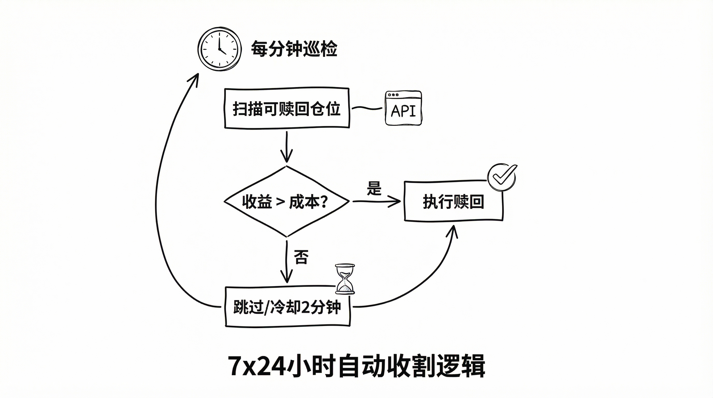

# Polymarket 量化交易实战（三）：Gnosis Safe 自动化交易

**EOA 是给人类用的，Proxy 才是给机器人的。**

如果你坚持用 MetaMask（EOA）跑脚本，你会遇到三个死结：
1.  **Gas 爆炸**：每笔赎回都要 0.01 Matic，高频策略的利润会被磨损殆尽。
2.  **并发锁死**：Nonce 机制强迫你串行交易，无法并发。
3.  **操作繁琐**：每次合并仓位都要手动签名。

要突破这些限制，我们需要引入 **Relayer（中继器）**。

#### 1. 所谓“无 Gas”，其实是有人买单


Polymarket 的 "Gasless Trading" 并非魔法。它的本质是 **Meta-Transaction（元交易）**。

流程很简单：
1.  **你（User）**：签一张“条子”（Intent），说我要买什么。
2.  **Relayer**：拿着条子，帮你在链上发起交易，并支付 Gas。
3.  **Proxy**：验证条子是你签的，然后执行操作。

这种架构把“签名权”和“执行权”分离了。

**这就是为什么我们需要 Gnosis Safe：它让账户变成了可编程的合约。**

#### 2. 核心实战：自动赎回（Auto Claim）

预测市场最麻烦的是结算。比赛结束了，你的钱还在合约里。手动点一千次？不可能。

**结算机制简介（UMA Optimistic Oracle）：**
*   市场结果由 UMA 预言机确定，而非 Polymarket 官方
*   任何人可以提交结算提案（需 $750 USDC.e 保证金）
*   提案后有 2 小时争议期，无争议则自动生效
*   胜利方每份获得 $1.00，失败方归零

我们需要一个 7x24 小时的收割机。

**第一步：告诉合约干什么（构建 Calldata）**

```python
def _encode_redeem(self, collateral, condition_id, index_sets):
    # 函数签名：redeemPositions
    # 这就像是在写汇编，告诉 EVM 要调用哪个函数、传什么参数
    signature = "redeemPositions(address,bytes32,bytes32,uint256[])"
    selector = keccak(text=signature)[:4]

    payload = encode(
        ["address", "bytes32", "bytes32", "uint256[]"],
        [str(collateral), bytes(0), bytes(condition_id), index_sets]
    )
    return "0x" + (selector + payload).hex()
```

**第二步：包装成 Safe 交易**

有了 Calldata，我们需要把它交给 Relayer：

```python
# 关键：这是一个 Meta-Transaction，而不是直接发上链
tx = SafeTransaction(
    to=Config.CTF_ADDRESS,
    operation=OperationType.Call,
    data=calldata,
    value="0"
)

# Relayer 帮我们上链
relayer.execute([tx], metadata="auto-claim")
```

#### 3. 守护进程：收益过滤



有了原子能力，还需要一个大脑。

并不是所有仓位都值得马上赎回。如果赎回金额小于 Gas 成本（虽然是 Relayer 付，但也要讲武德），或者 API 暂时不可用，都需要策略。

我的 `_auto_claim_worker` 遵循以下逻辑：

1.  **巡检**：每分钟扫描 `/positions?redeemable=true`。
2.  **估算**：链下计算 `Expected Payout`。
3.  **防抖**：失败后冷却 2 分钟，避免死循环攻击 Relayer。

#### 总结

通过 Gnosis Safe 和 Relayer，我们将原本需要人工点击、消耗 Gas 的链上操作，转化为了一段段静默运行的代码。

*   **Proxy Wallet** 解决了并发和可编程性。
*   **Relayer** 解决了 Gas 成本。

现在的机器人，已经有了**大脑（策略）**和**钱包（Proxy）**。但它的**手速**还不够快。

下一篇，我们将通过**批量下单（Batch Orders）**，把它的反应速度提升 10 倍。
