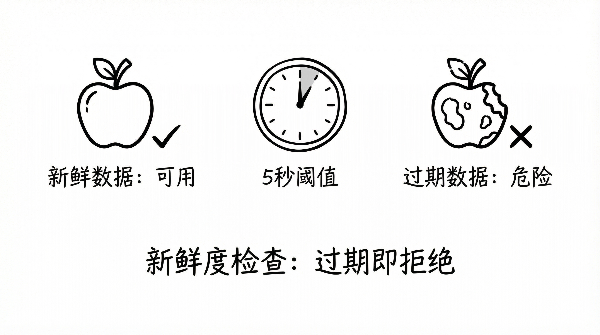
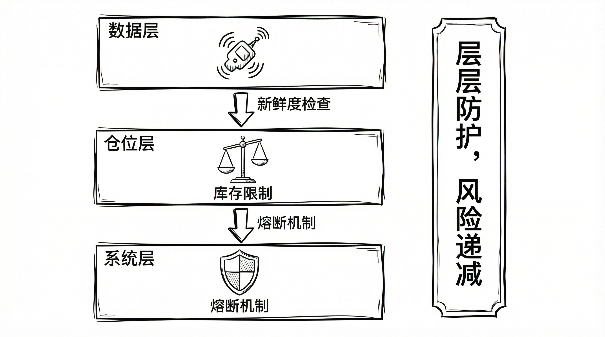

# Polymarket 量化交易实战（十）：风险管理实战

**活得久，比赚得多更重要。**

策略代码决定你能飞多高，而风控代码决定你能飞多远。
V5 版本中，风控代码占了 40%。

#### 1. 数据质量风控：Check Freshness or Die



高频交易的第一道防线是**数据源**。
如果眼睛看错了，手一定做错。

**新鲜度检查 (Freshness Check)**
在 `tick` 方法中，每一毫秒都在进行体检：

```python
MAX_STALE_MS = 5000.0 # 5秒红线

if (now - ts > MAX_STALE_MS):
    logger.warning("Data stale, SKIP")
    # 触发熔断：强制拉取快照，并跳过本次交易
    return
```

**实战意义：**
当 API 崩溃或网络断连时，本地数据会迅速“变质”。这行代码保证了我们绝不会基于“过期新闻”去交易。

#### 2. 价格风控：防止“胖手指”

我们是来赚 Spread 的，不是来当接盘侠的。

**价格上限保护：**
如果价格 > 0.95，风险收益比极差（为了赚 $0.05 承担 $0.95 的风险）。
直接停手。

**总价保护 (Spread Protection)：**
如果我们的买单价格之和过高：
*   Yes Bid: 0.60
*   No Bid: 0.45
*   **Sum = 1.05**

这就给市场留出了无风险套利空间（别人买我们两边，必赚）。
必须有硬性限制：

```python
if (price_yes + price_no) > 1.02:
    return # 亏本生意不做
```

#### 3. 仓位风控：动态库存管理



这是 V5 版本最核心的改进。
不再使用固定的“每单 $5”，而是基于当前持仓动态调整。

**动态扩容 (Inventory Expansion)：**
*   单边持仓上限：9.0 份。
*   对冲持仓上限：19.0 份。

如果 Yes 持仓达到 9 份，**彻底停止买入 Yes**，只挂单买入 No。
这迫使系统自动寻求平衡，而不是在那傻傻地单边加仓。

#### 总结

在 Polymarket 这种流动性稀缺、API 偶尔不稳定的新兴市场，**“防御性编程”** 是活下来的唯一法则。

宁可错过（Miss），绝不犯错（Error）。
