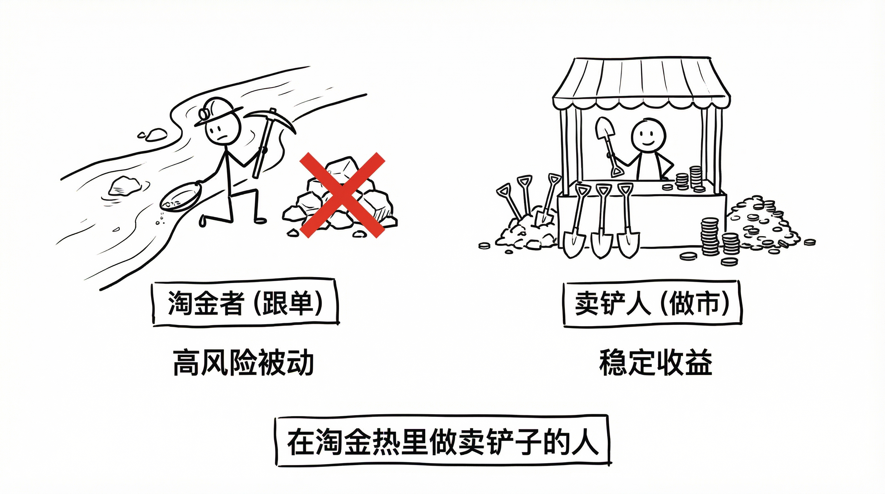

# Polymarket 量化交易实战（六）：产品决策复盘

**最痛苦的不是写代码，而是推翻自己的想法。**

在开发迭代中，我做了三个关键决策。每一次，都意味着要把之前的代码推倒重来。

#### 决策一：放弃“跟单”，拥抱“做市”



**最初的幻想：**
预测市场是信息不对称的。只要盯着胜率高的巨鲸（Smart Money），他们买啥我买啥。

**现实的打脸：**
1.  **滑点杀手**：巨鲸一笔大单把价格拉高 20%。我作为 Follower，进场就是高位。
2.  **成本劣势**：Taker 承担滑点损失，在 15 分钟 Crypto 市场还要付手续费。

**转向 Maker：**
V3 版本开始，我决定 **不预测方向**。
我在 Yes 和 No 两边同时挂买单（Bid）。
*   **逻辑**：预测市场流动性差，买一卖一之间有巨大的价差（Spread）。
*   **盈利**：我赚的是 **流动性溢价**。

**结论：在淘金热里，不做淘金者，做卖铲子的人。**

#### 决策二：放弃“预测模型”，转向“库存管理”


**复杂的归宿是过拟合。**
中期我曾引入 BTC 价格作为信号，试图预测市场走势。
代码写了一大堆，结果发现：预测市场要么滞后，要么过度反应。

**简单的力量：**
V5 版本删除了所有预测逻辑，只保留了 **库存管理（Inventory Management）**。

```python
# 核心逻辑比任何模型都简单
if pos_yes > max_pos_high:
    allow_buy_yes = False # 仓位重了就别买了
```

这个简单的 `if`，比任何 LSTM 模型都有效。它保证了我永远维持在 Delta Neutral（中性）状态。

#### 决策三：禁用 HTTP 回退

**Fail-Fast（快速失败）。**

在 Web 开发中，WebSocket 断了会自动降级到 HTTP。
V2 版本我也这么做了。

但在实盘中，这是个坑。
WS 断开往往是市场波动最剧烈的时候。此时 HTTP 的数据有 2 秒延迟。
**基于 2 秒前的价格挂单，等于闭眼开枪。**

V5 版本我做了一个激进决定：**Check Freshness or Die**。

```python
if (src != "ws") or (now - ts > 5000):
    logger.warning("Data stale, SKIP TICK")
    return # 宁愿不交易
```

**结论：不做单（Missed Opportunity）永远优于做错单（Bad Trade）。**

#### 这三刀真正砍掉了什么

这三次决策表面在改代码，实质在砍幻想。

1. 从“我要比别人更聪明”，改成“我要比系统更稳定”。
2. 从“我要猜中方向”，改成“我要把库存维持在可控区间”。
3. 从“系统不断服务”，改成“数据不可信就立刻停手”。

这不是保守，而是专业。交易系统先解决“别死”，才有资格讨论“多赚”。
