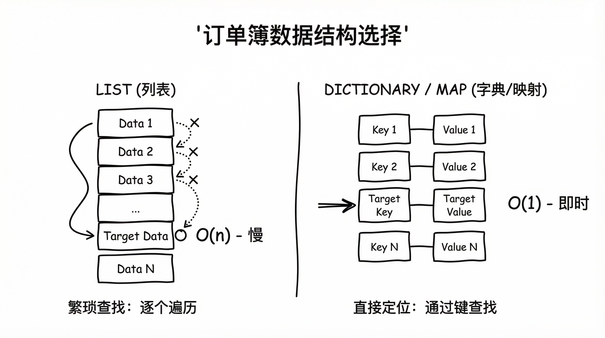
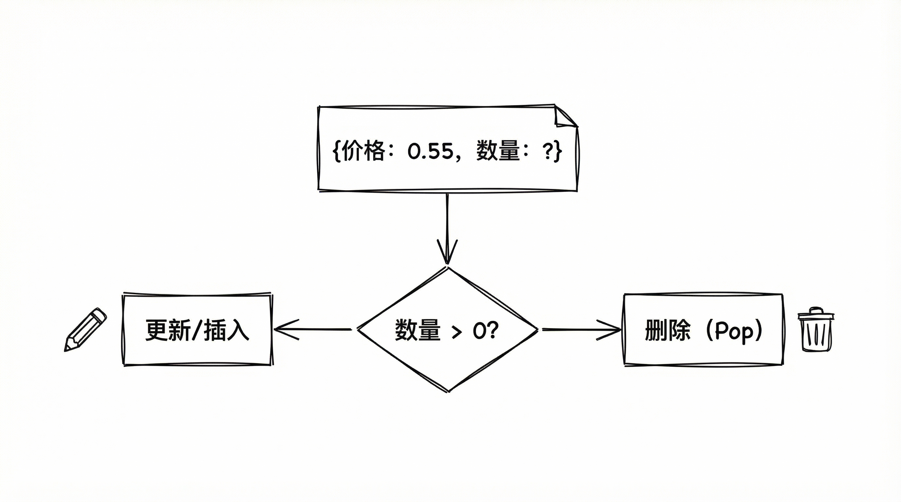
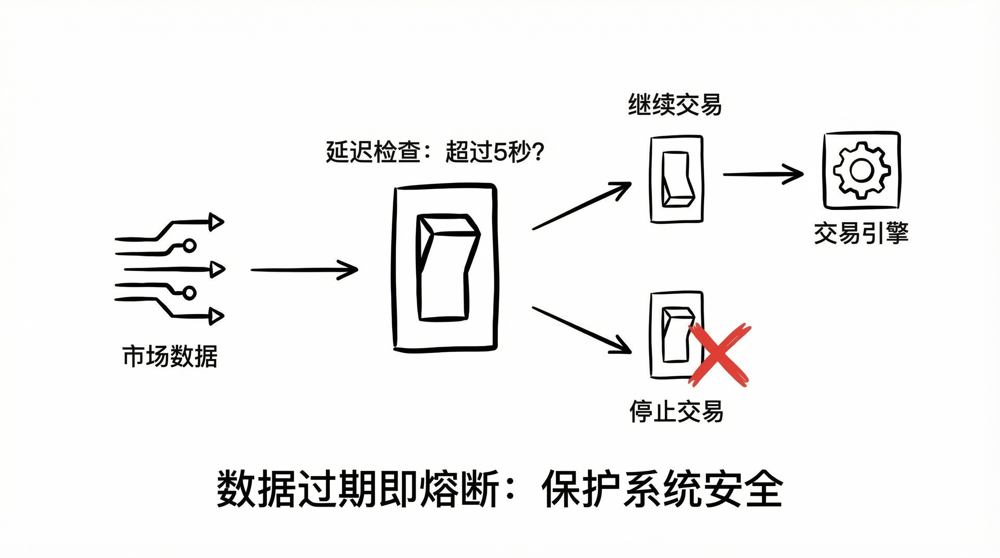

# Polymarket 量化交易实战（二）：WebSocket 订单簿设计

**2000ms vs 50ms。**

这是 HTTP 轮询和 WebSocket 的差距。在链上预测市场，2秒钟就像一个世纪那么漫长。

我开发 V1 版本机器人时，为了图省事用了 HTTP 轮询：

```python
while True:
    data = requests.get(url).json()
    decide_trade(data['price'])
    time.sleep(2)
```

结果很惨烈：单子永远成交不了，或者成交即亏损。

原因很简单：**当你通过 HTTP 看到价格时，那已经是“历史”了。**

要生存，必须升级到 WebSocket。

#### 1. 核心决策：字典胜过列表



为了在本地维护一个和交易所完全同步的 OrderBook，很多人第一反应是用列表（List）。

但我选择了双字典设计：

*   **Key**: 价格（Price）
*   **Value**: 数量（Size）

```python
class OrderBook:
    def __init__(self):
        self.bids = {}  # 买盘 {0.55: 100}
        self.asks = {}  # 卖盘 {0.60: 50}

    def get_best_bid(self):
        # O(N) in keys, but usually fast enough for top of book
        return max(self.bids.keys()) if self.bids else None
```

**设计哲学很简单：**

WebSocket 推送的是**价格层级的增量更新**。

当收到 "价格 0.55 数量变为 0" 的消息时：
*   字典操作是 **O(1)**
*   列表操作是 **O(n)**

在高频场景下，O(n) 是不可接受的。

#### 2. 增量同步的“坑”



Polymarket 的 WebSocket 协议有个大坑：**消息格式极其不一致**。

它混合了全量快照和增量更新。处理的核心逻辑只有两条：

1.  **更新**：Size > 0，直接覆盖字典。
2.  **删除**：Size = 0，从字典移除（Pop）。

```python
def update(self, bids=None):
    for b in bids or []:
        price, size = float(b["price"]), float(b["size"])
        if size == 0:
            self.bids.pop(price, None) # 数量为0即消失
        else:
            self.bids[price] = size
```

**实战经验：**
永远不要假设上游数据是完美的。字段名混用（token_id vs asset_id）、浮点数转换错误随时会发生。`try-except` 是最后的防线。

#### 3. 数据过期即熔断



即使有了 WebSocket，网络抖动也是常态。

如果数据卡住了，机器人必须立刻感知。我在策略循环中加入了一个强校验：

```python
max_stale_ms = 5000.0 # 5秒即过期

if (now_ms - up_ts) > max_stale_ms:
    logger.warning("Data too old, skip tick")
    return
```

这里我做了一个反直觉的决策：**拒绝 HTTP 回退**。

很多系统设计是 "WS 断了就降级到 HTTP"，但在高频预测市场，HTTP 的滞后数据是毒药。

**我宁愿不交易，也不要基于“历史”去交易。**

同理，一旦心跳丢失，必须触发“断连自动撤单”。闭上眼的时候，先把手缩回来。

#### 总结

构建毫秒级系统的三个原则：

1.  **基于字典的 O(1) 存取**
2.  **增量更新，全量校准**
3.  **数据过期即熔断**

掌握了实时数据流，你就拥有了和市场“同频呼吸”的能力。
