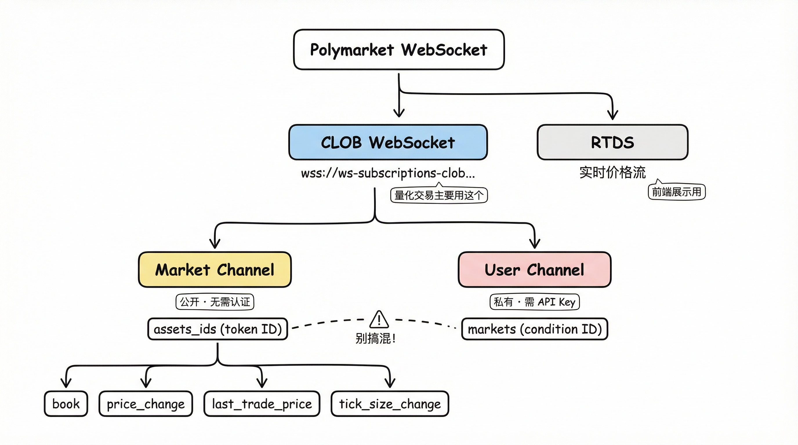

# Polymarket 量化交易实战（二）：WebSocket 实时数据流

**HTTP 轮询拿到的价格，是历史。**

V1 版本的 Bot 用 REST API 轮询盘口，2 秒一次。结果很直接：单子要么成交不了，要么成交即亏损。

预测市场的盘口变化快，2 秒的延迟足以让你看到的价格和实际价格完全脱节。要做量化，**必须接 WebSocket**。

---

## 两个 WebSocket，选哪个

Polymarket 提供两个 WebSocket 服务：

1. **CLOB WebSocket** — `wss://ws-subscriptions-clob.polymarket.com/ws/market`
   盘口、成交、价格变动，量化交易要的数据都在这里

2. **RTDS** — `wss://ws-live-data.polymarket.com`
   实时价格流和评论数据，更适合做前端展示

量化交易用 CLOB WebSocket。它分两个频道：

- **Market Channel** — 公开市场数据，不需要认证
- **User Channel** — 订单状态推送，需要 API Key 认证

我的 Bot 两个都接了。Market Channel 拿盘口数据做决策，User Channel 监听自己的订单状态，确认成交后再更新仓位。



## 连接与订阅

Market Channel 不需要认证，连上就能订阅：

```python
import websockets
import json

WS_URL = "wss://ws-subscriptions-clob.polymarket.com/ws/market"

async def subscribe(ws, asset_ids: list[str]):
    """订阅指定 token 的市场数据"""
    msg = {
        "assets_ids": asset_ids,
        "type": "market"
    }
    await ws.send(json.dumps(msg))
```

连接建立后可以动态增减订阅，不用断开重连：

```python
# 追加订阅
await ws.send(json.dumps({
    "assets_ids": [new_token_id],
    "type": "market",
    "operation": "subscribe"
}))

# 取消订阅
await ws.send(json.dumps({
    "assets_ids": [old_token_id],
    "type": "market",
    "operation": "unsubscribe"
}))
```

User Channel 需要认证，订阅格式不同：

```python
msg = {
    "markets": [condition_id],
    "type": "user",
    "auth": {
        "apiKey": api_key,
        "secret": secret,
        "passphrase": passphrase
    }
}
```

这里有个容易踩的坑：**Market Channel 用 `assets_ids`（token ID），User Channel 用 `markets`（condition ID）**。两个 ID 不是同一个东西。搞混了不会报错，只是收不到消息，debug 半天才发现。

【注：token ID 是某个 outcome 的唯一标识（比如 Yes token），condition ID 是整个市场的标识。一个 condition 下通常有两个 token（Yes 和 No）。】

## 四种消息，各有用处

订阅成功后会收到四种消息。不是每种都要处理，取决于你的策略。

### book — 盘口快照

首次订阅或盘口大幅变动时推送，包含完整的买卖盘：

```json
{
  "event_type": "book",
  "asset_id": "token_id",
  "market": "condition_id",
  "timestamp": "1700000000000",
  "buys": [
    { "price": "0.55", "size": "100" },
    { "price": "0.54", "size": "200" }
  ],
  "sells": [
    { "price": "0.60", "size": "50" },
    { "price": "0.61", "size": "150" }
  ],
  "hash": "0xabc..."
}
```

`buys` 和 `sells` 是价位数组，每项包含 `price` 和 `size`。注意**字段全是字符串**，需要自己转 float。我一开始直接拿来比较大小，怎么比都不对，排查了好一阵才意识到在比较字符串。

`hash` 是盘口内容的哈希值，可以校验本地盘口是否和服务端一致。实际跑下来，偶尔会出现本地盘口和服务端不同步的情况，定期用 hash 校验很有必要。

### price_change — 价格变动

有人下单或撤单时推送：

```json
{
  "event_type": "price_change",
  "market": "condition_id",
  "price_changes": [
    {
      "asset_id": "token_id",
      "price": "0.56",
      "size": "100",
      "side": "BUY",
      "best_bid": "0.55",
      "best_ask": "0.60"
    }
  ],
  "timestamp": "1700000000000"
}
```

这个消息直接给你 `best_bid` 和 `best_ask`，不需要自己从完整盘口计算。如果你的策略只关心最优报价，**用 price_change 比 book 高效得多**——数据量小，推送频率高。

我的策略主要依赖这个消息。book 只在启动时用来初始化盘口状态，之后全靠 price_change 驱动。

### last_trade_price — 最新成交

有成交时推送：

```json
{
  "event_type": "last_trade_price",
  "asset_id": "token_id",
  "price": "0.55",
  "side": "BUY",
  "size": "50",
  "fee_rate_bps": "0",
  "timestamp": "1700000000000"
}
```

`side` 是主动方向——BUY 说明是买方吃了卖单，SELL 反之。`fee_rate_bps` 是手续费率，单位是基点（1 基点 = 0.01%）。

成交数据对判断市场方向有用。连续出现大单 BUY，说明有人在扫货。

### tick_size_change — 最小刻度变化

当价格接近 0 或 1（>0.96 或 <0.04），最小报价刻度会从 0.01 变成 0.001：

```json
{
  "event_type": "tick_size_change",
  "asset_id": "token_id",
  "old_tick_size": "0.01",
  "new_tick_size": "0.001"
}
```

这个消息容易被忽略。但如果你的策略在极端价格区间运行（比如事件即将结算），**不处理刻度变化会导致下单被拒**。我在一次选举结算前就吃过这个亏，Bot 连续报错 INVALID_TICK_SIZE，排查才发现是刻度变了没更新。

## 心跳：10 秒一次 PING

WebSocket 连接不发心跳会被服务端断开。Polymarket 要求每 10 秒发一次 PING：

```python
import asyncio

async def heartbeat(ws):
    while True:
        await ws.send("PING")
        await asyncio.sleep(10)
```

心跳和消息处理要并行跑：

```python
async def run():
    async with websockets.connect(WS_URL) as ws:
        await subscribe(ws, asset_ids)
        await asyncio.gather(
            heartbeat(ws),
            handle_messages(ws)
        )
```

## 断连处理：先撤单，再重连

WebSocket 不是万能的。网络抖动、服务端重启都会导致数据中断。

每条消息都带 `timestamp`，用它判断数据新鲜度：

```python
MAX_STALE_MS = 5000  # 5 秒

def is_stale(msg_timestamp: str) -> bool:
    age = time.time() * 1000 - int(msg_timestamp)
    return age > MAX_STALE_MS
```

数据过期时，策略应该**立即停止交易**。不要降级到 HTTP 轮询——HTTP 拿到的数据延迟更大，基于过时数据交易只会亏更多。

断连时的原则很简单：**先撤单，再重连。**

```python
async def handle_disconnect():
    # 1. 立即撤销所有挂单
    await client.cancel_all()
    # 2. 等待后重连
    await asyncio.sleep(2)
    await reconnect()
```

顺序不能反。先重连再撤单的话，重连期间挂单还在盘口上，盘口已经变了但你不知道，被成交了就是盲盒。

## 完整的消息处理框架


把上面的逻辑串起来：

```python
async def handle_messages(ws):
    async for raw in ws:
        if raw == "PONG":
            continue

        msg = json.loads(raw)
        event = msg.get("event_type")

        if is_stale(msg.get("timestamp", "0")):
            logger.warning("数据过期，跳过")
            continue

        if event == "book":
            update_orderbook(msg)
        elif event == "price_change":
            on_price_change(msg)
        elif event == "last_trade_price":
            on_trade(msg)
        elif event == "tick_size_change":
            on_tick_size_change(msg)
```

框架本身不复杂。难的是每个 handler 里的具体逻辑——怎么维护本地盘口、怎么判断信号、怎么管理订单状态。这些在后续的文章里会详细展开。

---

拿到实时数据流，才有资格谈策略。REST API 是看后视镜开车，WebSocket 才是挡风玻璃。

---

### 参考

- [Polymarket WSS Overview](https://docs.polymarket.com/developers/CLOB/websocket/wss-overview)
- [Market Channel](https://docs.polymarket.com/developers/CLOB/websocket/market-channel)
- [WSS Quickstart](https://docs.polymarket.com/quickstart/websocket/)
