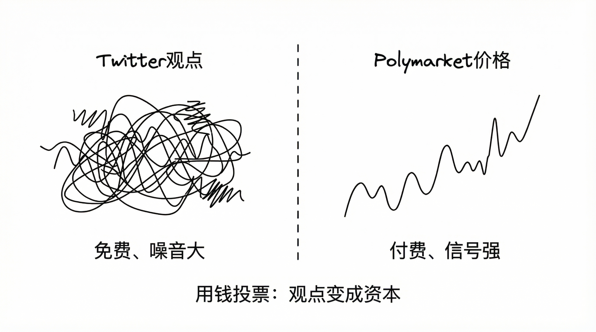
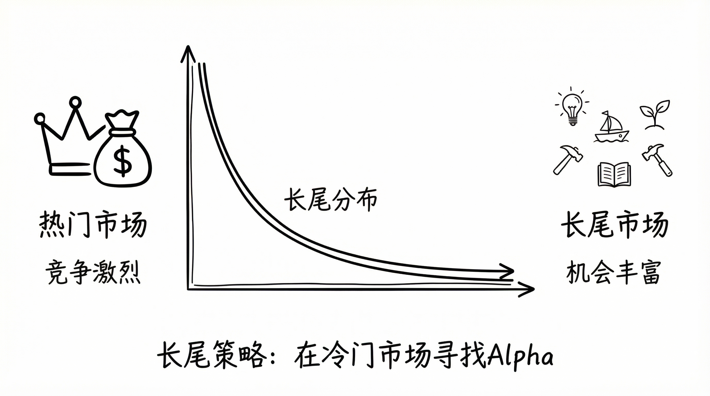

# Polymarket 量化交易实战（终章）：预测市场的未来

**这不仅仅是投机。**

在完成了开发和交易后，我不再把 Polymarket 仅仅看作一个套利场所。
本文作为终章，聊聊技术之外的思考。

#### 1. 信息定价的革命

海耶克说：“价格体系是一种传递信息的机制。”
Polymarket 证明了这一点。在大选期间，它的赔率比民调更准。

**从“观点”到“资本”**
Twitter 上的观点是免费的，噪音很大。
Polymarket 上的观点要付钱。
**Skin in the Game（利益攸关）** 天然过滤了噪音，留下了最纯粹的信息精华。

**未来的搜索引擎：**
未来你不再搜索“特朗普会赢吗？”，而是直接看一眼 Polymarket 的价格图表。
**价格即真理。**

#### 2. 基础设施的阵痛

虽然前景美好，但目前的痛点依然明显。

*   **性能瓶颈**：极端行情下，API 依然会挂。去中心化和高性能之间，依然有 Impossible Trinity。
*   **门槛过高**：Proxy Wallet、USDC 跨链、Relayer... 对普通用户来说，这简直是天书。

**Account Abstraction（账户抽象）** 将是未来的必经之路。

#### 3. 开发者（我们）的机会

除了做市商，我们还能做什么？

**垂直领域的做市：**
目前流动性集中在政治和 Crypto。
体育、天气、流行文化等长尾市场（Long-tail Markets）极度缺水。
这就是 **Indie Developer** 的蓝海。写一个专攻“英超”的 Bot，竞争比 BTC 市场小得多。

**数据服务：**
基于 Polymarket 的数据，开发“舆情分析工具”或“二元期权对冲基金”。
例如：对冲某公司 CEO 离职风险。

#### 全系列的落点

写到这里，这个系列真正验证的不是“某个策略一定赚钱”，而是另一件更实在的事：

预测市场可以被工程化地拆解、实现、迭代。

你不需要先成为金融专家，才有资格动手。  
先把数据流、下单流、状态流和风控链路跑通，再在真实反馈里不断修正判断。

这条路不浪漫，但很可靠。  
如果这套系列有价值，我希望它传递的是这种可复制的方法，而不是一句口号。
