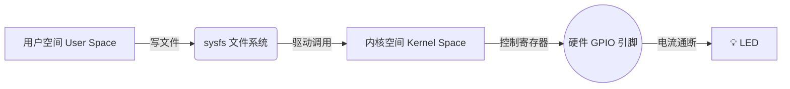

# 💡 上帝说要有光：Linux GPIO 入门指南

在嵌入式开发的世界里，"点灯" (Blinking LED) 的地位等同于编程语言界的 "Hello World"。如果你能控制一个 LED 的亮灭，你就能控制继电器、电机、甚至核弹发射井（理论上）。

在 Linux 中，有一句至理名言：**"一切皆文件" (Everything is a file)**。

是的，连硬件引脚也是文件。我们可以像写文本文件一样，通过读写特定的系统文件来控制电压高低。是不是很酷？

## 🗺️ 核心流程：SYSFS 大法

我们使用 `sysfs` 接口来操作 GPIO。想象一下，你作为一个系统管理员，通过修改文件系统里的"配置单"，直接指挥硬件干活。



## 🛠️ 实战演练：五步点亮你的世界

假设我们要控制的引脚是 `GPIO53` (对应具体的物理引脚需查阅你的开发板手册)。

### 1. 占地盘 (Export)

首先，我们要告诉内核："这个引脚归我管了"。这会在 `/sys/class/gpio/` 下生成一个新的文件夹 `gpio53`。

```bash
# "喂，内核，给我准备好 53 号引脚"
echo 53 | sudo tee /sys/class/gpio/export
```

### 2. 定规矩 (Direction)

引脚是用来**读**（输入，如按钮）还是**写**（输出，如LED）？这里我们要控制 LED，所以是 Output。

```bash
# "这引脚我要用来对外输出信号"
echo "out" | sudo tee /sys/class/gpio/gpio53/direction
```

### 3. 亮瞎眼 (Value High)

见证奇迹的时刻。写入 `1` 代表高电平（通常是 3.3V 或 1.8V），LED 亮起！

```bash
# "通电！"
echo 1 | sudo tee /sys/class/gpio/gpio53/value
```

### 4. 关灯睡觉 (Value Low)

写入 `0` 代表低电平（GND），LED 熄灭。

```bash
# "断电！"
echo 0 | sudo tee /sys/class/gpio/gpio53/value
```

### 5. 归还借用的东西 (Unexport)

用完了记得释放资源，这是一个好习惯。

```bash
# "用完了，还给你"
echo 53 | sudo tee /sys/class/gpio/unexport
```

## 📜 懒人脚本 (Cheat Sheet)

把下面的脚本保存为 `blink.sh`，修改 `PIN_NUM` 即可随处运行。

```bash
#!/bin/bash
PIN_NUM=53

echo "Testing GPIO $PIN_NUM..."

# 1. Export
echo $PIN_NUM | sudo tee /sys/class/gpio/export > /dev/null

# 2. Set Output
echo "out" | sudo tee /sys/class/gpio/gpio$PIN_NUM/direction

# 3. Blink 3 times
for i in {1..3}
do
    echo "ON"
    echo 1 | sudo tee /sys/class/gpio/gpio$PIN_NUM/value
    sleep 0.5
    echo "OFF"
    echo 0 | sudo tee /sys/class/gpio/gpio$PIN_NUM/value
    sleep 0.5
done

# 4. Cleanup
echo $PIN_NUM | sudo tee /sys/class/gpio/unexport > /dev/null
echo "Done!"
```

## 🤔 进阶思考

使用 `sysfs` (echo/cat) 的方式简单直观，适合 shell 脚本和调试。但在高性能场景下（比如你要模拟 PWM 波形或者快速翻转 IO），这种方式效率极低（因为每次操作都涉及文件系统 IO 和用户态/内核态切换）。

对于正经的 C/C++ 程序，推荐使用 `libgpiod` 或者直接操作寄存器（mmap）。但对于只是想点个灯庆祝一下的我们，`echo 1` 足够了！
