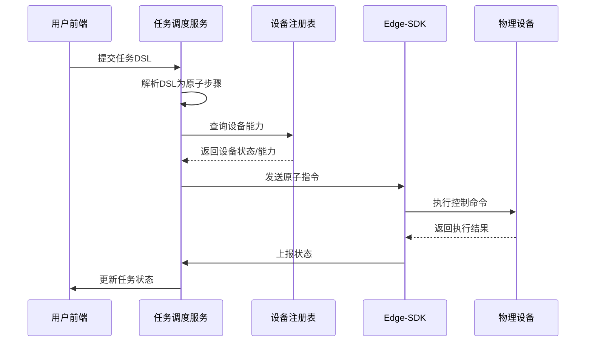

# 分布式机器人多机协同巡检系统设计

这篇文章是对之前做过的分布式机器人多机协同系统的一些设计和思考的整理归纳。写下来主要是为了复盘思路，理清架构，同时也能给后来者提供一些参考。

## 一、基本概念

我们要解决的问题是：**如何让多个异构机器人设备协同完成巡检任务**。这意味着系统需要统一调度无人机、地面机器人、固定相机和其他边缘计算节点等

从架构层面看，最合理的方式是 **中心控制**：

- 云端负责全局调度与任务编排，下发统一的任务指令；
- 各设备只需按照分配的任务执行，并将运行状态上报云端

为了让不同类型的设备（厂商不同、协议不同）都能被调度，需要一套**统一的规范**。这就引出两个关键点：

1. **任务 DSL（Domain-Specific Language，领域专用语言）**：标准化的任务描述语言，用来表达“任务是什么，如何执行”
2. **设备建模（物模型 Thing Model）**：将设备的能力抽象化，形成一个统一的接口层

这样，云端就可以只关心“做什么”，而不用关心“设备是怎么做的”

------

### 物模型（Thing Model）

这里借用 DJI 的 TSL（Thing Specification Language）概念
 物模型本质上是一个 **设备的数字化表示**，从三个维度描述了设备的能力：

- **属性 (Property)**：设备的状态参数，例如无人机的姿态、电池电量、相机模式等。
- **服务 (Service)**：可被外部调用的功能，例如“起飞”、“拍照”、“导航到某坐标点”。
- **事件 (Event)**：设备运行过程中触发的事件，例如“进入禁飞区”、“电量不足告警”。

一个典型的物模型 JSON 结构大致如下：

```
{
    "profile": {},    	# 表示该产品是什么
    "properties": [],   # 表示该产品有哪些属性
    "services": [],   	# 表示该产品有哪些可以被外部调用的能力和方法
    "events": []    	# 表示该产品有哪些需要被外部感知和处理的通知信息
}
```

物模型带来的最大好处是：**统一设备能力的抽象层**
 这和 Linux 的“万物皆文件”哲学很像 —— 设备千差万别，但在云端看来，它们都是一类“能力集合”

------

### HMS 健康管理系统

除了设备能力的定义，系统还需要关注**设备健康状态**。例如无人机是否有故障、地面机器人是否掉线、电池是否异常

健康管理（HMS, Health Management System）的核心价值在于：

- **提前预警**：发现设备潜在问题，防止任务中断
- **规则化处理**：通过规则引擎定义告警与处理方式（比如低电量自动返航）
- **自动化恢复**：某些情况下设备可以自愈，或者系统自动重新分配任务

这里可以参考 [RuleGo](https://rulego.cc/)，一个轻量的规则引擎库，非常适合做设备健康管理和任务规则处理。

------

### AI 与自然语言任务编排

当我们有了任务 DSL 和物模型后，会发现这和 **AI 的 MCP（Model Context Protocol）** 思路非常类似：

- 物模型定义设备能力
- 任务 DSL 定义调用方式

这就意味着：任务完全可以用自然语言描述，再由 AI 转换成 DSL
 例如：

> “让无人机飞到点 A 巡检，同时让地面机器人去点 B”

AI 就能翻译成 DSL JSON
 不过为了安全起见，生产系统应该采用 **“AI 生成任务 + 人工审核”** 的模式

**Prompt**示例

```json
你是⼀个任务编排引擎的助⼿，负责将⽤户输⼊的⾃然语⾔任务，转换为结构化的任务调度 JSON DSL。
请严格按照以下格式和能⼒描述，⽣成合法的 JSON 结构，供调度系统直接使⽤。
---
【任务描述格式】：
- `name`: 任务名称（简洁命名）
- `steps`: 任务步骤数组，每个步骤为⼀个任务动作，具有以下结构：
每个 step ⽀持以下字段：
- `type`: 任务动作类型，例如 `drone.goto`, `dog.capture`
- `target`: 执⾏此动作的设备 ID，例如 `drone1`, `dog1`
- `params`: 执⾏动作所需参数（根据设备能⼒）
- `retry`: （可选）失败重试次数，例如 2
- `onError`: （可选）失败时的备⽤动作，例如 `{ "type": "drone.return" }`
- `condition`: （可选）仅在满⾜条件时执⾏，例如 `"battery > 30"`
- `type: "group"` 表示并发步骤，包含⼀个 `tasks` 数组
---
【已注册设备及能⼒信息如下】：
{{devices}}
- 设备 drone1（类型 drone）⽀持：
- takeoff()：起⻜
- goto(lat, lng, alt)：前往坐标
- capture()：拍照
- return()：返回起点
- 设备 dog1（类型 dog）⽀持：
- goto(x, y)：前往坐标
- capture()：拍照
- pose(poseType)：切换姿态
---
【⽤户任务描述】：
{{user_prompt}}
请让⽆⼈机⻜到 A 点并拍照，机器狗同时巡视 B 点并拍照。
---
【请⽣成合法 JSON】（不要解释，不要注释）：
```


------

## 二、系统架构

我采用的是 **“中心任务编排 + 边缘执行”** 的架构

- **云端**：负责 DSL 解析、任务调度、规则编排
- **设备端（edge-sdk）**：只负责原子指令执行，例如“飞到坐标点”、“转动云台”、“拍照”
- **设备能力匹配**：通过物模型自动适配，不同厂商的设备都能即插即用

核心服务模块：

- **任务调度编排引擎**
- **规则引擎**（健康管理、异常处理）
- **HMS 服务**（设备状态监控）
- **边缘层服务 edge-sdk**

### edge-sdk 的功能

edge-sdk 是设备侧的统一接入 SDK，封装了一些核心能力：

- 注册与心跳机制
- 执行本地控制指令（ROS、串口、HTTP 等多种方式）
- 状态上报与事件推送

------

## 三、任务 DSL

一个简单任务 DSL 示例：

```
{
  "name": "同步巡检任务",
  "steps": [
    {
      "type": "group",
      "tasks": [
        { "type": "drone.goto", "target": "drone1", "params": { "lat": 32.1, "lng": 114.2 } },
        { "type": "dog.goto", "target": "dog1", "params": { "x": 10, "y": 20 } }
      ]
    }
  ]
}
```

可以看出，它的思路和 DJI 航线文件很类似，会定义航点、动作、并行/串行执行逻辑等，所以这个功能需要参考航线文件格式来写

### 多机器人协同调度示例

比如一个“区域 A 全面巡检”任务，会被 Mission Service 拆分成：

1. 通知机巢开机，检查无人机状态
2. 无人机起飞，前往坐标 A1-A5 拍照上传
3. 同时，地面机器人巡检 A6-A9
4. 所有数据汇总到 Telemetry
5. 任务完成后，无人机返航，机器人回初始点

这种多机协同，本质上是任务 DSL 与设备物模型的结合。





------

## 四、涉及的关键概念

| 概念                  | 作用                   | 在系统中的体现             |
| --------------------- | ---------------------- | -------------------------- |
| FSM（有限状态机）     | 控制状态流转与异常处理 | 任务状态 / 设备状态        |
| DAG（有向无环图）     | 表达任务依赖关系       | DSL 任务步骤结构           |
| DSL（领域专用语言）   | 用户友好的任务定义方式 | JSON 结构任务描述          |
| Thing Model（物模型） | 描述设备能力           | 设备即插即用、自动匹配任务 |
| 事件驱动              | 异步触发与解耦         | 任务执行、告警上报         |

DAG 在这里尤其重要：任务往往不是线性的，而是一个有依赖的图。通过 DAG，我们可以精确描述“哪个步骤依赖于哪个步骤”，避免混乱

------

## 五、一些需要注意的问题

1. **坐标系转换**
   - 手动建模地图与雷达 SLAM 地图往往不在同一坐标系下
   - 解决方案：
     - 建模时以点云为基准；
     - 或者在前端人工对齐，调整机器人位置和旋转角度。
2. **协议兼容**
   - 不同厂商的机器人通信方式不同（MQTT、WebSocket、HTTP、ROS Topic），需要在 edge-sdk 层统一封装，或者云端主动进行适配

------

## 参考资料

- [DJI 上云 API](https://developer.dji.com/cn/cloud-api/)
- [阿里云物联网平台](https://help.aliyun.com/zh/iot/product-overview/what-is-iot-platform)